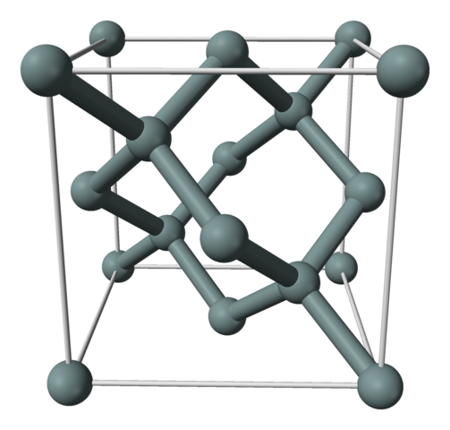

footer: Carsten Wulff 2023
slidenumbers:true
autoscale:true
theme: Plain Jane, 1
text:  Helvetica
header:  Helvetica
date: 2023-10-26

<!--pan_skip: -->

# Diodes

---

<!--pan_doc: 

<iframe width="560" height="315" src="https://www.youtube.com/embed/ibByzO02OLY?si=z4kiNzZ16dVcZlhs" title="YouTube video player" frameborder="0" allow="accelerometer; autoplay; clipboard-write; encrypted-media; gyroscope; picture-in-picture; web-share" allowfullscreen></iframe>

-->

<!--pan_title: Diodes -->

# Why

Diodes are a magical [^1] semiconductor device that conduct current in one direction. It's one of the fundamental electronics components, and it's a good idea to understand how they work.

<!--pan_doc:

If you don't understand diodes, then you won't understand transistors, neither
bipolar, or field effect transistors.

A useful feature of the diode is the exponential relationship
between the forward current, and the voltage across the device.

To understand why a diode works it's necessary to understand the physics behind
semiconductors. 

This paper attempts to explain in the simplest possible terms how a diode works [^2]

-->

---

<!--pan_doc: 

# Silicon

Integrated circuits use single crystalline silicon. The silicon crystal is grown
with the [Czochralski method](https://en.wikipedia.org/wiki/Czochralski_method)
which forms a ingot that is cut into wafers. The wafer is a regular
silicon crystal, although, it is not perfect. 

A [silicon]() crystal unit cell, as seen in Figure 1 is a diamond faced cubic with 8 atoms in the corners spaced at 0.543 nm, 6 at the center of the
faces, and 4 atoms inside the unit cell at a nearest neighbor distance of 0.235
nm. 

*Figure 1: Silicon crystal unit cell*

As you hopefully know, the energy levels of an electron around a positive
nucleus are quantized, and we call them orbitals (or shells). For an atom far
away from any others, these orbitals, and energy levels are distinct. As we
bring atoms closer together, the orbitals start to interact, and in a crystal,
the distinct orbital energies split into bands of allowed energy states. No two
electrons, or any Fermion (spin of $1/2$), can occupy the same quantum state.
We call the outermost "shared" orbitial, or band, in a crystal the valence band.
Hence covalent bonds. 

If we assume the crystal is perfect, then at 0 Kelvin all electrons will be part of
covalent bonds. Each silicon atom share 4
electrons with its neighbors. I think what we really mean when we say "share 4
electrons" is that the wave-functions of the outer orbitals interact, and
we can no longer think of the orbitals as belonging to either of the silicon
nuclei. All the neighbors atoms "share" electrons, and
nowhere is there an vacant state, or a hole, in the valence band. If such a
crystal were to exist, it would not conduct any current, as the charges cannot
move. 

In a atom, or a crystal, there are also higher energy states where the carriers
are "free" to move. We call these energy levels, or bands of energy levels,
conduction bands. In singular form "conduction band", refers to the lowest
available energy level where the electrons are free to move. 

Due to imperfectness of the silicon crystal, and non-zero temperature, there
will be some electrons that achieve sufficient energy to jump to the conduction
band. The electrons in the conduction band leave vacant states, or holes, in the
valence band. 

Electrons can move both in the conduction band, as free electrons, and in the
valence band, as a positive particle, or hole. 

-->

# Intrinsic carrier concentration

The intrinsic carrier concentration of silicon, or how many free electrons and holes at a given temperature, is given by 

---

<!--pan_skip: -->

$$
n_i = \sqrt{N_c N_v} e^{-\frac{E_g}{2 k T}} 
$$

---

<!--pan_doc: 

$$
n_i = \sqrt{N_c N_v} e^{-\frac{E_g}{2 k T}} 
\tag{1} 
\label{eq:ni}
$$

where $E_g$ is the bandgap energy of silicon (approx 1.12 eV), $k$ is Boltzmann's constant, $T$ is
the temperature in Kelvin, $N_c$ is the density of states in conduction band,
and $N_v$ is the density of states in the valence band. 

-->

The density of states are

$$ N_c = 2 \left[\frac{2 \pi  k T m_n^*}{h^2}\right]^{3/2} \text{  } N_v = 2 \left[\frac{2 \pi  k T m_p^*}{h^2}\right]^{3/2} $$

<!--pan_doc: 

where $h$ is Planck's constant, $m_n^\ast$ is the effective mass of electrons, and
$m_p^\ast$ is the effective mass of holes.

-->

---

<!--pan_doc:

In [@cjm11] they claim the intrinsic carrier concentration is a constant, although
they do mention $n_i$ doubles every 11 degrees Kelvin. 

-->

In BSIM 4.8 [@bsim] the intrinsic carrier concentration is 

$$ n_{i} = 1.45e10 \frac{TNOM}{300.15} \sqrt{\frac{T}{300.15} \exp^{21.5565981
- \frac{E_g}{2kT}}} $$

<!--pan_doc: 
Comparing the three models in Figure 2, we see the shape of BSIM and
the full equation is almost
the same, while the "doubling every 11 degrees" is just wrong.

-->

<!--pan_doc:
*Figure 2: Intrinsic carrier concentration versus temperature*

At room temperature the intrinsic carrier consentration is approximately
$n_{i} =  1 \times 10^{16}$ carriers/m$^3$.

That may sound like a big number, however, if we calculate the electrons
per $um^{3}$ it's
$n_{i} = \frac{1 \times 10^{16}}{(1 \times 10^{6})^{3}} \text{ carriers}/\mu \text{m}^{3}< 1$,
so there are really not that many free carriers in intrinsic silicon.

But where does Eq \eqref{eq:ni} come from? I find it  unsatisfying
if I don't understand where things come from. I like to understand why there is
an exponential, or effective mass, or Planck's constant. If you're like me, then
read the next section. If you don't care, and just want to memorize the
equations, or indeed the number of intrinsic carrier concentration number at
room temperature, then skip the next section.

-->

<!--pan_doc:

# It's all quantum

There are two components needed to determine how many electrons are in the
conduction band. The density of available states, and the probability of an
electron to be in that quantum state. 

For the density of states we must turn to quantum mechanics. The probability
amplitude of a particle can be described as  

$$\psi = Ae^{i(k \textbf{r} - \omega t)}$$ 

where $k$ is the wave number, and $\omega$ is the angular frequency, and
$\textbf{r}$ is a spatial vector. 

In one dimension we could write $\psi(x,t) = Ae^{i(kx - \omega t)}$ 

In classical physics we described the Energy of the system as
$$\frac{1}{2 m} p^2 + V = E$$ 
where $p = m v$, $m$ is the mass, $v$ is the velocity and $V$ is the potential.

In the quantum realm we must use the Schrodinger equation to compute the time
evolution of the Energy, in one space dimension

$$-\frac{\hbar^2}{2 m} \frac{\partial^2}{\partial^2 x}\psi(x,t) +
V(x)\psi(x,t) = i\hbar\frac{\partial}{\partial t} \psi(x,t) $$

where $m$ is the mass, $V$ is the potential, $\hbar = h/2\pi$.

We could rewrite the equation above as 

$$ \widehat{H} \psi(x,t) = i \hbar \frac{\partial}{\partial t}  \psi(x,t)  =
\widehat{E}  \psi(x,t)$$

where $\widehat{H}$ is sometimes called the *Hamiltonian* and is an operator,
or something that act on the wave-function. I recently read [Feynman's
Lectures on Physics](https://www.feynmanlectures.caltech.edu), and Feynman
called the Hamiltonian the *Energy Matrix* of a system. I like that better. The
$\widehat{E}$ is the energy operator, something that operates on the
wave-function to give the Energy. 

We could re-arrange

$$ [\widehat{H} - \widehat{E}]\psi(r,t) = 0$$
 
This is an equation with at least 5 unknowns, the space vector in three dimensions, time, and the
energy matrix  $\widehat{H}$. It turns out, that the energy matrix depends
on the system. The energy matrix further up is for one free electron. For an atom, the
energy matrix will have more dimensions to describe the possible quantum states.
 
I was watching [Quantum computing in the 21st
Century](https://youtu.be/zxml8UQSwC0) and David Jamison mentioned that the
largest system we could today compute would be a system with about 30
electrons. So although we know exactly how the equations of quantum mechanics
appear to be, and they've proven extremely successful, we must make
simplifications before we can predict how electrons behave in complicated
systems like the silicon lattice with approximately 0.7 trillion electrons per
cube micro meter. You can check the calculation
 
$$ \left[\frac{1 \text{ }\mu\text{m}}{ 0.543\text{ nm}}\right]^3 \times 8 \text{ atoms per unit
 cell} \times 14 \text{ electrons per atom}$$ 

-->

---

## Density of states 

<!--pan_doc:

To compute "how many Energy states are there per unit volume in the
conduction band", or the "density of states", we start with the three
dimensional Schrodinger equation for a free electron

-->

[.column]

$$-\frac{\hbar^2}{2m}\nabla^2\psi = E\psi$$

<!--pan_doc:

I'm not going to repeat the computation here, but rather paraphrase the steps.
You can find the full derivation in [Solid State Electronic
Devices](https://www.amazon.com/Solid-State-Electronic-Devices-7th/dp/0133356035).

The derivation starts by computing the density of states in the k-space, or
 momentum space, 
 
 -->
 
$$N(dk) = \frac{2}{(2 \pi)^p} dk$$

<!--pan_doc: 
 
Where $p$ is the number of dimensions (in our case 3).

Then uses the band structure $E(k)$ to convert to the density of states as a
function of energy $N(E)$. The simplest band structure, and a approxmiation of
the lowest conduction band is

-->

$$E(k) = \frac{\hbar^2 k^2}{2 m^*}$$

<!--pan_doc:

where $m^*$ is the effective mass of the particle. It is within this effective
mass that we "hide" the complexity of the actual three-dimensional crystal
structure of silicon. 

The effective mass when we compute the density of states is  

-->

[.column]

$$m^* = \frac{\hbar^2}{\frac{d^2 E}{dk^2}}$$

<!--pan_doc: 

as such, the effective mass depends on the localized band structure of the
silicon unit cell, and depends on direction of movement, strain of the silicon
lattice, and probably other things.

In 3D, once we use the above equations, one can compute that the density of
states per unit energy is 

-->

$$N(E)dE = \frac{2}{\pi^2}\frac{m^*}{\hbar^2}^{3/2} E^{1/2}dE$$

<!--pan_doc:

In order to find the number of electrons, we need the probability of an electron
being in a quantum state, which is given by the [Fermi-Dirac
distribution](https://en.wikipedia.org/wiki/Fermi–Dirac_statistics)

-->

---

<!--pan_skip: -->

$$f(E) = \frac{1}{e^{(E - E_F)/kT}  + 1} $$

---

<!--pan_doc: 

$$
 f(E) = \frac{1}{e^{(E - E_F)/kT}  + 1}
\tag{2}
\label{eq:fm}
$$

where $E$ is the energy of the electron, $E_F$ is the [Fermi
level](https://en.wikipedia.org/wiki/Fermi_level) or checmical potential,
$k$ is Boltzmann's constant, and $T$ is the temperature in Kelvin. 

Fun fact, the Fermi level difference between two points is what you measure with a voltmeter.

If the
$E -E_F > kT$, then we can start to ignore the $+1$ and the probability reduces
to

$$ f(E) = \frac{1}{e^{(E-E_F)/kT}} = e^{(E_F - E)/kT}$$

A few observiation on the Fermi-Dirac distribution. If the Energy of a particle
is at the Fermi level, then $f(E) = \frac{1}{2}$, or a 50 % probability. 

In a metal, the Fermi level lies within a band, as the conduction
band and valence band overlap. As a result, there are a bunch of free electrons
that can move around. Metal does not have the same type of covalent bonds as
silicon, but electrons are shared between a large part of the metal structure. I would also assume that
the location of the Fermi level within the band structure explains the difference in
conductivity of metals, as it would determined how many electrons are free to
move. 

In an insulator, the Fermi level lies in the bandgap between valence band and
conduction band, and usually, the bandgap is large, so there is a
low probability of finding electrons in the conduction band. 

In a semiconductor we also have a bandgap, but much lower energy than an insulator.
If we have thermal equilibrium, no external forces, and
we have an un-doped (intrinsic) silicon semiconductor, then the fermi level $E_F$ lies half way between the
conduction band edge $E_C$ and the valence band edge $E_V$. 

The bandgap is defined
as the $E_C - E_V = E_g$, and we can use that to get 
$E_F - E_C = E_C - E_g/2 - E_C= -E_g/2$. This is why the bandgap of silicon
keeps showing up in our diode equations.

The number of electrons per delta energy will then be given by  

-->

$$N_e dE = N(E)f(E)dE$$

<!--pan_doc: 

, which can be integrated to get 

-->

---

$$
n_e = 2\left( \frac{2 \pi m^\ast k T}{h^2}\right)^{3/2} e^{(E_F - E_C)/kT}
$$

---

<!--pan_skip: -->

For intrinsic silicon at thermal equlibrium, we could write

$$
n_0 = 2\left( \frac{2 \pi m^\ast k T}{h^2}\right)^{3/2} e^{-E_g/(2kT)}
$$

---

<!--pan_doc: 

For intrinsic silicon at thermal equlibrium, we could write

$$
n_0 = 2\left( \frac{2 \pi m^\ast k T}{h^2}\right)^{3/2} e^{-E_g/(2kT)}
\tag{3}
\label{eq:nc0}
$$

As we can see, Equation \eqref{eq:nc0} has the same coefficients and form as the
computation in Equation \eqref{eq:ni}. The
difference is that we also have to account for holes. At thermal equilibrium
and intrinsic silicon $n_i^2 = n_0 p_0$.

## How to think about electrons (and holes)
I've come to the realization that to imagine electrons as balls moving around in
the silicon crystal is a bad mental image. 

For example, for a metal-oxide-semiconductor field effect transistor (MOSFET) it is not
the case that the electrons that form the inversion layer under strong inversion
come from somewhere else. They are already at the silicon surface, but they are
bound in covalent bonds (there are literaly trillions of bound electrons in a
typical transistor). 

What happens is that the applied voltage at the gate shifts the energy bands
close to the surface (or bends the bands in relation to the Fermi level), and the density of carriers in the
conduction band in that
location changes, according to the type of derivations above. 

Once the electrons are in the conduction band, then they follow the same
equations as diffusion of a gas,  [Fick's law of
diffusion](https://en.wikipedia.org/wiki/Fick%27s_laws_of_diffusion). 
Any charge concentration difference will give rise to a [diffusion
current](https://en.wikipedia.org/wiki/Diffusion_current) given by 

\begin{equation}
\tag{4}
\label{eq:diff}
J_{\text{diffusion}} = - qD_n \frac{\partial \rho}{\partial x}
\end{equation}

where $J$ is the current density, $q$ is the charge, $\rho$ is the charge density, and  $D$ is a diffusion
coefficient that through the [Einstein
relation](https://en.wikipedia.org/wiki/Diffusion_current) can be expressed as
$D = \mu k T$, where mobility $\mu = v_d/F$ is the ratio of drift velocity $v_d$
to an applied force $F$.  

To make matters more complicated, an inversion layer of a MOSFET is not in three
dimensions, but rather a [two dimensional electron
gas](https://en.wikipedia.org/wiki/Two-dimensional_electron_gas), as the density of
states is confined to the silicon surface. As such, we should not expect the
mobility of bulk silicon to be the same as the mobility of a MOSFET transistor.

-->

# Doping

<!--pan_doc:
We can change the property of silicon by introducing other elements, something
we've called [doping](https://en.wikipedia.org/wiki/Doping_(semiconductor)).
Phosphor has one more electron than silicon, Boron has one less
electron. Injecting these elements into the silicon crystal
lattice changes the number of free electron/holes.

These days, we usually dope with [ion implantation](https://en.wikipedia.org/wiki/Ion_implantation), while in the olden days,
most doping was done by [diffusion](https://ieeexplore.ieee.org/document/1050758). You'd paint something containing Boron on the
silicon, and then heat it in a furnace to "diffuse" the Boron atoms into the
silicon.

If we have an
element with more electrons we call it a donor, and the donor
concentration $N_{D}$. 

The main effect of doping is that it changes the location
of the Fermi level at thermal equilibirum. For donors, the Fermi level will
shift closer to the conduction band, and increase the probabilty of free
electrons, as determined by Equation \eqref{eq:fm}.

Since the crystal now has an abundance of
free electrons, which have negative charge, we call it n-type.

If the element has less electrons we call
it an acceptor, and the acceptor concentration $N_{A}$. Since the
crystal now has an abundance of free holes, we call it p-type. 

The doped material does not have a net charge, however, as it's the same number of
electrons and protons, so even though we dope silicon, it does remain neutral.

The 
doping concentrations are larger than the intrinsic carrier
concentration, from maybe $10^{21}$ to $10^{27}$ carriers/m$^{3}$. To
separate between these concentrations we use $p-,p,p+$ or $n-, n, n+$.

-->

The number of electrons and holes in a n-type material is

$$ n_n = N_D \text{ ,  } p_n = \frac{n_i^2}{N_D} $$

and in a p-type material

$$ p_p = N_A \text{ , } n_p = \frac{n_i^2}{N_A} $$

<!--pan_doc: 

In a p-type crystal there is a majority of holes, and a minority of
electrons. Thus we name holes majority carriers, and electrons minority
carriers. For n-type it's opposite.

--->

---

# PN junctions

<!--pan_doc:

Imagine an n-type material, and a p-type material, both are neutral in
charge, because they have the same number of electrons and protons. Within both
materials there are free electrons, and free holes which move around
constantly. 

Now imagine we bring the two materials together, and we call where they meet the
junction. Some of the electrons
in the n-type will wander across the junction to the p-type material, and visa versa.
On the opposite side of the junction they might find an opposite charge, and might get locked in place.
They will become stuck. 

After a while, the diffusion of charges across the junction creates a depletion region with immobile
charges. Where as the two materials used to be neutrally charged, there
will now be a build up of negative charge on the p-side, and positive
charge on the n-side. 

-->

---

## Built-in voltage

<!--pan_doc: _

The charge difference will create a field, and a built-in voltage will develop across the depletion
region. 

The density of free electrons in the conduction band is

-->

[.column]

$$
n = \int_{E_C}^{\infty} N(E) f(E) dE 
$$

<!--pan_doc: _

, where $N(E)$ is the density of states, and $f(E)$ is a probability of a
electron being in that state (Equation \eqref{eq:fm}). 

We could write the density of electrons on the n-side as 

-->

$$
n_n = e^{E_{F_n}/kT} \int_{E_C}^{\infty} N_n(E) e^{-E/kT}dE 
$$

<!--pan_doc: 

since the Fermi level is independent of the energy state of the electrons (I think).

The density of electrons on the p-side could be written as

-->

$$
n_p = e^{E_{F_p}/kT} \int_{E_C}^{\infty} N_p(E) e^{-E/kT}dE 
$$

<!--pan_doc:

If we assume that the density of states, $N_n(E)$ and $N_p(E)$ are the same, and
the temperature is the same, then

-->

$$
\frac{n_n}{n_p} = \frac{ e^{E_{F_n}/kT}}{e^{E_{F_p}/kT}} = e^{(E_{F_n} - E_{F_p})/kT}
$$

<!--pan_doc:

The difference in Fermi levels is the built-in voltage multiplied by the unit
charge.

-->

[.column]

$$
E_{F_n} - E_{F_p} = q\Phi
$$

<!--pan_doc:

and by substituting for the minority carrier concentration on the p-side we get

-->

$$\frac{N_A N_D}{n_i^2} = e^{q\Phi_0/kT}$$

or rearranged to 

$$\Phi_0 = \frac{kT}{q} ln\left(  \frac{N_A N_D}{n_i^2} \right)$$

---

## Current

<!--pan_doc: 

The derivation of current is a bit involved, but let's try.

The hole concentration on the p-side and n-side could be written as 

-->

[.column]

$$
\frac{p_p}{p_n} = e^{-q\Phi_0/kT}
$$

<!--pan_doc:

The negative sign is because the built in voltage is positive on the n-type side 

Asssume that $-x_{p0}$ is the start of the junction on the p-side, and $x_{n0}$
is the start of the junction on the n-side.

Assume that we lift the p-side by a voltage $qV$

Then the hole concentration would change to

-->

$$
\frac{p(-x_{p0})}{p(x_{n0})} = e^{q(V-\Phi_0)/kT}
$$

<!--pan_doc: 

while on the n-side the hole concentration would be 

-->

$$
\frac{p(x_{n0})}{p_n} = e^{qV/kT}
$$

<!--pan_doc:

So the excess hole concentration on the n-side due to an increase of $V$ would
be 

-->

[.column]

$$
\Delta p_n = p(x_{n0}) - p_n = p_n\left( e^{qV/kT} -1 \right)
$$

<!--pan_doc: 

The diffusion current density, given by Equation \eqref{eq:diff} states 

-->

$$
J(x_n) = -q D_p \frac{\partial \rho}{\partial x} 
$$

<!--pan_doc:

Thus we need to know the charge density as a function of $x$. I'm not sure why,
but apparently it's

-->

$$
\partial \rho(x_n) = \Delta p_n e^{-x_n/L_p}
$$

<!--pan_doc:

where $L_p$ is a diffusion length. This equation smells to me like a simplified
model of reality, I'm not sure how much it's based on fundamental physics.

Anyhow, we can now compute the current density, and need only compute it for
$x_n$ = 0, so you can show it's 

-->

$$
J(0) = q\frac{D_p}{L_p} p_n \left( e^{qV/kT} - 1\right)
$$

<!--pan_doc:

which start's to look like the normal diode equation. The $p_n$ is the minority
concentration of holes on the n-side, which we've before estimated as $p_n =
\frac{n_i^2}{N_D}$ 

We've only computed for holes, but there will be electron transport from the
p-side to the n-side also. 

We also need to multiply by the area of the diode to get current from current
density. The full equation thus becomes

-->

---

$$
I = q A n_i^2 \left( \frac{1}{N_A}\frac{D_n}{L_n} + \frac{1}{N_D}\frac{D_p}{L_p}
\right)\left[ e^{qV/kT} - 1 \right]
$$

---

<!--pan_doc:

where $A$ is the area of the diode, $D_n$,$D_p$ is the diffusion coefficient of electrons
and holes and $L_n$,$L_p$ is the diffusion length of electrons and holes. 

Which we usually write as 

$$ I_D = I_S(e^{\frac{V_D}{V_T}} - 1 ),\text{ where } V_T = kT/q $$

-->

---

## Forward voltage temperature dependence

<!--pan_doc: 

We can rearrange $I_D$ equation to get

-->

$$ V_D = V_T \ln\left(\frac{I_D}{I_S}\right) $$

---

<!--pan_doc:

and at first glance, it appears like $V_D$ has a positive temperature
coefficient. That is, however, wrong.

First rewrite

-->

[.column]

$$ V_D = V_T \ln{I_D} - V_T \ln{I_S} $$

$$ \ln{I_S} =  2 \ln{n_i} +  \ln{Aq\left (\frac{D_n}{L_n N_A} +
\frac{D_p}{L_p N_D}\right)} $$

<!--pan_doc:

Assume that diffusion coefficient [^3], and diffusion lengths are independent of
temperature. 

That leaves $n_i$ that varies with temperature.

-->

$$ n_i = \sqrt{B_c B_v} T^{3/2} e^\frac{-E_g}{2 kT} $$

<!--pan_doc:

where 

-->

$$ B_c = 2 \left[\frac{2 \pi  k m_n^*}{h^2}\right]^{3/2} \text{  } B_v = 2 \left[\frac{2 \pi  k m_p^*}{h^2}\right]^{3/2} $$

[.column]

$$ 2 \ln{n_i} = 2\ln{\sqrt{B_c B_v}}  + 3 \ln T -
\frac{V_G}{V_T}$$

<!--pan_doc:

with $V_G = E_G/q$ and inserting back into equation for $V_D$

-->

$$ V_D = \frac{kT}{q}(\ell  - 3 \ln T) + V_G $$ 

<!--pan_doc:

Where $\ell$ is temperature independent, and given by

-->

$$ \ell= \ln{I_D} - \ln{\left (Aq\frac{D_n}{L_n N_A} +
\frac{D_p}{L_p N_D}\right)}  - 2 \ln{\sqrt{B_c B_v}} $$

---

From  equations above we can see that at 0 K, we expect the diode voltage to be
equal to the bandgap of silicon. Diodes don't work at 0 K though. 

Although it's not trivial to see that the diode voltage has a negative temperature coefficient, if you do compute it as in
[vd.py](https://github.com/wulffern/memos/blob/main/2021-07-08_diodes/vd.py), then you'll see it decreases. 

The slope of the diode voltage can be seen to depend on the area, the current,
doping, diffusion constant, diffusion length and the effective masses. 

<!--pan_doc:

Figure 3 shows the $V_D$ and the deviation of $V_D$ from a straight line. The
non-linear component of $V_D$ is only a few mV. If we could combine $V_D$ with a
voltage that increased with temperature, then we could get a stable voltage
across temperature to within a few mV.

-->

<!--pan_doc:
*Figure 3: Diode forward voltage as a function of temperature*
-->

---

## Current proportional to temperature 

<!--pan_doc: 

Assume we have a circuit like Figure 4. 

Here we have two diodes, biased at different current densities. The voltage on
the left diode $V_{D1}$ is equal to the sum of the voltage on the right diode $V_{D2}$ and voltage
across the resistor $R_1$. The current in the two diodes are the same due to
the current mirror. A such, we have that

-->

$$ I_S e^\frac{qV_{D1}}{kT} = N I_S e^\frac{qV_{D2}}{kT} $$

Taking logarithm of both sides, and rearranging, we see that 

$$ V_{D1} - V_{D2} = \frac{kT}{q}\ln{N}$$

<!--pan_doc: 

Or that the difference between two diode voltages biased at different current densities is proportional to absolute
temperature. 

In the circuit above, this $\Delta V_D$ is across the resistor
$R_1$, as such, the $I_D  = \Delta V_D/R_1$. We have a current that is
proportional to temperature.

If we copied the current, and sent it into a series combination of a resistor
$R_2$ and a diode, we could scale the $R_2$ value to give us the exactly right
slope to compensate for the negative slope of the $V_D$ voltage. 

The voltage across the resistor and diode would be constant over temperature,
with the small exception of the non-linear component of $V_D$.

-->

---

<!--pan_skip: -->

#[fit] Thanks!

---

<!--pan_doc:

*Figure 4: Circuit to generate a current proportional to kT*
-->

<!--pan_doc:

# Equations aren't real

> Nature does not care about equations. It just is. 

We know, at the fundamental
level, nature appears to obey the mathematics on quantum mechanics, however, due to
the complexity of nature, it's not possible today (which is not the same as
impossible), to compute exactly how the current in a diode works. We can get
close, by measuring a diode we know well, and hope that the next time we make
the same diode, the behavior will be the same. 

As such, I want to warn you about the "lies" or "simplifications" we tell you. Take the
diode equation above, some parts, like the intrinsic carrier concentration $n_i$
has roots directly from quantum mechanics, with few simplifications, which means
it's likely solid truth, at least for a single unit cell. 

But there is no reason
nature should make all unit cells the same, and infact, we know they are not the
same, we put in dopants. As we scale down to a few nano-meter transistors the simplification
that "all unit cells of silicon are the same, and extend to infinity" is no
longer true, and must be taken into account in how we describe reality.

Other parts, like the exact value of the bandgap $E_g$, the diffusion constant
$D_p$ or diffusion length $L_p$ are macroscopic phenomena,  we can't
expect them to be $100%$ true. The values would be based on measurement, but not
always exact, and maybe, if you rotate your diode, they would be different. 

You should realize that the consequence of our imperfection is that the equations in
electronics should always be taken with a grain of salt. 

Nature does not care about your equations. Nature will easily have the
superposition of trillions of electrons, and they don't have to
agree with your equations. 

But most of the time, the behavior is similar.

## References

-->

[^1]: It doesn't stop being magic just because you know how it works. Terry Pratchett, The Wee Free Men

<!--pan_doc:
[^2]: Simplify as much as possible, but no more. Einstein
[^3]: From the Einstein relation $D = \mu k T$ it does appear that the diffusion coefficient increases with temperature, however, the mobility decreases with temperature. I'm unsure of whether the mobility decreases with the same rate though.
-->
