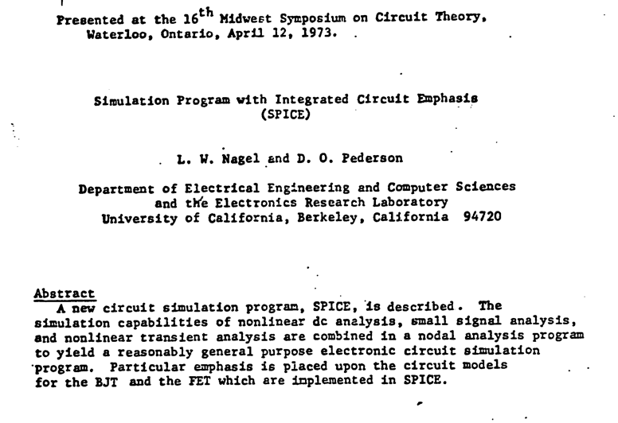
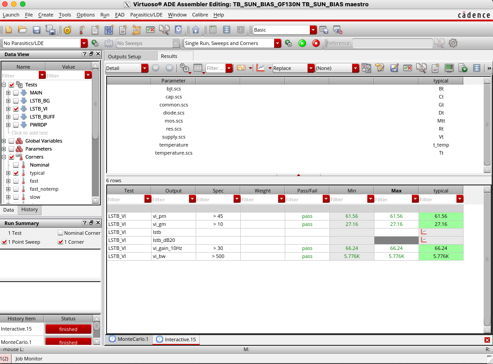
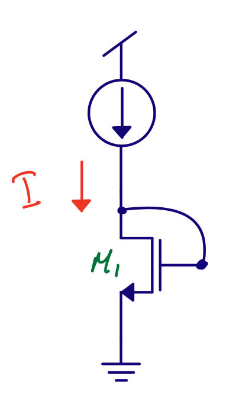

footer: Carsten Wulff 2024
slidenumbers:true
autoscale:true
theme: Plain Jane, 1
text:  Helvetica
header:  Helvetica
date: 2024-09-11

#[fit] SPICE

<!--pan_title: SPICE  -->

<!--pan_doc: 

<iframe width="560" height="315" src="https://www.youtube.com/embed/z9go-m0hnIg?si=YI3uCt9mp4Ei65Xo" title="YouTube video player" frameborder="0" allow="accelerometer; autoplay; clipboard-write; encrypted-media; gyroscope; picture-in-picture; web-share" referrerpolicy="strict-origin-when-cross-origin" allowfullscreen></iframe>

-->

---

# Simulation Program with Integrated Circuit Emphasis

<!--pan_doc: 


To manufacture an integrated circuit we have to be able to predict how it's going to work. The only way to predict is to rely on our knowledge of physics, and build models 
of the real world in our computers. 

One simulation strategy for a model of the real world, which absolutely every single integrated circuit in the world has used to come into existence, is SPICE. 

-->

Published in 1973 by Nagel and Pederson


[SPICE (Simulation Program with Integrated Circuit Emphasis)](https://www2.eecs.berkeley.edu/Pubs/TechRpts/1973/ERL-m-382.pdf)




---
## Today

<!--pan_doc:


There are multiple SPICE programs that has been written, but they all work in a similar fashion. There are expensive ones, closed source, and open source. 

Some are better at dealing with complex circuits, some are faster, and some are more accurate. If you don't have money, then start with ngspice. 

-->

[.column]
**Commercial**
[Cadence Spectre](https://www.cadence.com/ko_KR/home/tools/custom-ic-analog-rf-design/circuit-simulation/spectre-simulation-platform.html)
[Siemens Eldo](https://eda.sw.siemens.com/en-US/ic/eldo/)
[Synopsys HSPICE](https://www.synopsys.com/implementation-and-signoff/ams-simulation/primesim-hspice.html)

[.column]
**Free**
[Aimspice](http://aimspice.com)
[Analog Devices LTspice](https://www.analog.com/en/design-center/design-tools-and-calculators/ltspice-simulator.html)

**Open Source**
[ngspice](http://ngspice.sourceforge.net)

---
## But

<!--pan_doc:


All SPICE simulators understand the same language (yes, even spectre can speak SPICE). We write our testbenches in a text file, and give it to the SPICE program. That's the same for all programs. Some may have 
built fancy GUI's to hide the fact that we're really writing text files, but text files is what is under the hood.

-->

Pretty much the same usage model as 48 years ago

    <spice program> testbench.cir
    
for example

    ngspice testbench.cir
    
Or in the most expensive analog tool (Cadence Spectre)

     spectre  input.scs  +escchars +log ../psf/spectre.out 
      -format psfxl -raw ../psf   +aps +lqtimeout 900 -maxw 5 -maxn 5 -env ade  -ahdllibdir 
      /tmp/wulff/virtuoso/TB_SUN_BIAS_GF130N/TB_SUN_BIAS/maestro/results/maestro/Interactive.15/sharedData/CDS/ahdl/input.ahdlSimDB 
      +logstatus 

---

The expensive tools have built graphical user interface around the SPICE simulator to make it easier to run multiple scenarios. 

| Corner | Typical | Fast | Slow | All |
|:---|:---|:---|:---|:---|
|Mosfet| Mtt | Mff| Mss | Mff,Mfs,Msf,Mss|
|Resistor |Rt |Rl | Rh | Rl,Rh|
|Capacitors| Ct| Cl |Ch | Cl,Ch|
|Diode| Dt| Df | Ds | Df,Ds|
|Bipolar| Bt | Bf|Bs|Bf,Bs|
|Temperature| Tt | Th,Tl | Th,Tl | Th,Tl|
|Voltage| Vt | Vh,Vl | Vh,Vl| Vh,Vl|




<!--pan_doc:

I'm a fan of launching multiple simulations from the command line. I don't like GUI's. As such, I wrote [cicsim](https://github.com/wulffern/cicsim/tree/main), and that's what I use in the video and demo.

-->

---

## Sources

<!--pan_doc:

The SPICE language is a set of conventions for how to write the text files. In general, it's one line, one command (although, lines can be continued with a +). 

I'm not going to go through an extensive tutorial in this document, and there are dialects with different SPICE programs. You'll find more info at [ngspice](http://ngspice.sourceforge.net/docs.html)

-->

[.column]

### Independent current sources

<sub>Infinite output impedance, changing voltage does not change current</sub>

```
I<name> <from> <to> dc <number> ac <number>

I1 0 VDN dc In
I2 VDP 0 dc Ip

```


[.column]

### Independent voltage source 

<sub>Zero output impedance, changing current does not change voltage</sub>

```
V<name> <+> <-> dc <number> ac <number>

V2 VSS 0 dc 0
V1 VDD 0 dc 1.5

```

---

## Passives

[.column]

Resistors

```
R<name> <node 1> <node 2> <value>

R1 N1 N2 10k
R2 N2 N3 1Meg
R3 N3 N4 1G
R4 N4 N5 1T
```

[.column]

Capacitors

```
C<name> <node 1> <node 2> <value>

C1 N1 N2 1a
C2 N1 N2 1f
C4 N1 N2 1p
C3 N1 N2 1n
C5 N1 N2 1u

```

---

## Transistor Models

Needs a model file the transistor model

BSIM (Berkeley Short-channel IGFET Model)
[http://bsim.berkeley.edu/models/bsim4/](http://bsim.berkeley.edu/models/bsim4/)

---


284 parameters in [BSIM 4.5](http://www-device.eecs.berkeley.edu/~bsim/Files/BSIM4/BSIM480/BSIM480_Manual.pdf)

```ruby
.MODEL N1 NMOS LEVEL=14 VERSION=4.5.0 BINUNIT=1 PARAMCHK=1 MOBMOD=0
CAPMOD=2 IGCMOD=1 IGBMOD=1 GEOMOD=1  DIOMOD=1 RDSMOD=0 RBODYMOD=0 RGATEMOD=3
PERMOD=1 ACNQSMOD=0 TRNQSMOD=0 TEMPMOD=0  TNOM=27 TOXE=1.8E-009
TOXP=10E-010 TOXM=1.8E-009  DTOX=8E-10 EPSROX=3.9 WINT=5E-009 LINT=1E-009
LL=0 WL=0 LLN=1 WLN=1  LW=0 WW=0 LWN=1 WWN=1  LWL=0 WWL=0 XPART=0
TOXREF=1.4E-009  SAREF=5E-6 SBREF=5E-6 WLOD=2E-6 KU0=-4E-6  KVSAT=0.2
KVTH0=-2E-8 TKU0=0.0 LLODKU0=1.1  WLODKU0=1.1 LLODVTH=1.0 WLODVTH=1.0
LKU0=1E-6  WKU0=1E-6 PKU0=0.0 LKVTH0=1.1E-6 WKVTH0=1.1E-6  PKVTH0=0.0
STK2=0.0 LODK2=1.0 STETA0=0.0  LODETA0=1.0  LAMBDA=4E-10  VSAT=1.1E 005
VTL=2.0E5 XN=6.0 LC=5E-9  RNOIA=0.577 RNOIB=0.37
LINTNOI=1E-009  WPEMOD=0 WEB=0.0 WEC=0.0 KVTH0WE=1.0  K2WE=1.0 KU0WE=1.0
SCREF=5.0E-6  TVOFF=0.0 TVFBSDOFF=0.0  VTH0=0.25  K1=0.35 K2=0.05
K3=0  K3B=0 W0=2.5E-006 DVT0=1.8 DVT1=0.52  DVT2=-0.032 DVT0W=0 DVT1W=0
DVT2W=0  DSUB=2 MINV=0.05 VOFFL=0 DVTP0=1E-007  DVTP1=0.05 LPE0=5.75E-008
LPEB=2.3E-010 XJ=2E-008  NGATE=5E 020 NDEP=2.8E 018 NSD=1E 020 PHIN=0
CDSC=0.0002 CDSCB=0 CDSCD=0 CIT=0  VOFF=-0.15 NFACTOR=1.2 ETA0=0.05
ETAB=0  UC=-3E-011  VFB=-0.55 U0=0.032 UA=5.0E-011 UB=3.5E-018  A0=2
AGS=1E-020 A1=0 A2=1 B0=-1E-020 B1=0  KETA=0.04 DWG=0 DWB=0 PCLM=0.08
PDIBLC1=0.028 PDIBLC2=0.022 PDIBLCB=-0.005 DROUT=0.45  PVAG=1E-020
DELTA=0.01 PSCBE1=8.14E 008 PSCBE2=5E-008  RSH=0 RDSW=0 RSW=0 RDW=0
FPROUT=0.2 PDITS=0.2 PDITSD=0.23 PDITSL=2.3E 006  RSH=0 RDSW=50 RSW=150
RDW=150  RDSWMIN=0 RDWMIN=0 RSWMIN=0 PRWG=0  PRWB=6.8E-011 WR=1
ALPHA0=0.074 ALPHA1=0.005  BETA0=30 AGIDL=0.0002 BGIDL=2.1E 009 CGIDL=0.0002
EGIDL=0.8  AIGBACC=0.012 BIGBACC=0.0028 CIGBACC=0.002  NIGBACC=1
AIGBINV=0.014 BIGBINV=0.004 CIGBINV=0.004  EIGBINV=1.1 NIGBINV=3 AIGC=0.012
BIGC=0.0028  CIGC=0.002 AIGSD=0.012 BIGSD=0.0028 CIGSD=0.002  NIGC=1
POXEDGE=1 PIGCD=1 NTOX=1  VFBSDOFF=0.0  XRCRG1=12 XRCRG2=5  CGSO=6.238E-010
CGDO=6.238E-010 CGBO=2.56E-011 CGDL=2.495E-10  CGSL=2.495E-10
CKAPPAS=0.03 CKAPPAD=0.03 ACDE=1  MOIN=15 NOFF=0.9 VOFFCV=0.02  KT1=-0.37
KT1L=0.0 KT2=-0.042 UTE=-1.5  UA1=1E-009 UB1=-3.5E-019 UC1=0 PRT=0
AT=53000  FNOIMOD=1 TNOIMOD=0  JSS=0.0001 JSWS=1E-011 JSWGS=1E-010 NJS=1
IJTHSFWD=0.01 IJTHSREV=0.001 BVS=10 XJBVS=1  JSD=0.0001 JSWD=1E-011
JSWGD=1E-010 NJD=1  IJTHDFWD=0.01 IJTHDREV=0.001 BVD=10 XJBVD=1  PBS=1 CJS=0.0005
MJS=0.5 PBSWS=1  CJSWS=5E-010 MJSWS=0.33 PBSWGS=1 CJSWGS=3E-010  MJSWGS=0.33
PBD=1 CJD=0.0005 MJD=0.5  PBSWD=1 CJSWD=5E-010 MJSWD=0.33 PBSWGD=1
CJSWGD=5E-010MJSWGD=0.33 TPB=0.005 TCJ=0.001 TPBSW=0.005 TCJSW=0.001 TPBSWG=0.005
TCJSWG=0.001  XTIS=3 XTID=3  DMCG=0E-006 DMCI=0E-006 DMDG=0E-006 DMCGT=0E-007  DWJ=0.0E-008 XGW=0E-007
XGL=0E-008  RSHG=0.4 GBMIN=1E-010 RBPB=5 RBPD=15  RBPS=15 RBDB=15 RBSB=15 NGCON=1
JTSS=1E-4 JTSD=1E-4 JTSSWS=1E-10 JTSSWD=1E-10 JTSSWGS=1E-7 JTSSWGD=1E-7  NJTS=20.0
NJTSSW=20 NJTSSWG=6 VTSS=10 VTSD=10 VTSSWS=10 VTSSWD=10  VTSSWGS=2 VTSSWGD=2
XTSS=0.02 XTSD=0.02 XTSSWS=0.02 XTSSWD=0.02 XTSSWGS=0.02 XTSSWGD=0.02
```	   
---

## Transistors

```

M<name> <drain> <gate> <source> <bulk> <modelname> [parameters]


M1 VDN VDN VSS VSS nmos W=0.6u L=0.15u
M2 VDP VDP VDD VDD pmos W=0.6u L=0.15u


```

---

## Foundries

Each foundry has their own SPICE models bacause the transistor parameters depend on the exact physics of the technology!

[https://skywater-pdk.readthedocs.io/en/main/](https://skywater-pdk.readthedocs.io/en/main/)


---


# Find right transistor sizes

Assume active ($$V_{ds} > V_{eff}$$ in strong inversion, or $$V_{ds} > 3 V_T$$ in weak inversion). For diode connected transistors, that is always true.

Weak inversion: 
$$ I_{D} = I_{D0} \frac{W}{L} e^{V_eff / n V_T} $$, $$V_{eff} \propto \ln{I_D} $$

Strong inversion: 
$$ I_{D} = \frac{1}{2} \mu_n C_{ox} \frac{W}{L} V_{eff}^2$$, $$V_{eff} \propto \sqrt{I_D} $$

**Operating region for a diode connected transistor only depends on the current**



---

## Use unit size transistors for analog design

 $$ W/L \approx \in[4, 6, 10] $$, but should have space for two contacts
 
Use parallel transistors for larger W/L

Amplifiers $$\Rightarrow L \approx 1.2 \times L_{min} $$

Current mirrors $$\Rightarrow L \approx 4 \times L_{min} $$

Choose sizes that have been used by foundry for measurement to match SPICE model

---

## What about gm/Id ?

Weak $$ \frac{g_m}{I_d} = \frac{1}{nV_T}$$

Strong $$ \frac{g_m}{I_d} = \frac{2}{V_{eff}}$$

---

## Characterize the transistors

[http://analogicus.com/cnr\_atr\_sky130nm/mos/CNRATR\_NCH\_2C1F2.html](http://analogicus.com/cnr_atr_sky130nm/mos/CNRATR_NCH_2C1F2.html)

---

# More information

[Ngspice Manual](http://ngspice.sourceforge.net/docs/ngspice-34-manual.pdf)

[Installing tools](https://analogicus.com/aicex/started/)

---

# Analog Design

1. **Define the problem, what are you trying to solve?**
1. **Find a circuit that can solve the problem (papers, books)**
1. **Find right transistor sizes. What transistors should be weak inversion, strong inversion, or don't care?**
1. **Check operating region of transistors (.op)**
1. **Check key parameters (.dc, .ac, .tran)**
1. **Check function. Exercise all inputs. Check all control signals**
1. Check key parameters in all corners. Check mismatch (Monte-Carlo simulation)
1. Do layout, and check it's error free. Run design rule checks (DRC). Check layout versus schematic (LVS)
1. Extract parasitics from layout. Resistance, capacitance, and inductance if necessary.
1. On extracted parasitic netlist, check key parameters in all corners and mismatch (if possible).
1. If everything works, then your done.

*On failure, go back*

---

# Demo 

[https://github.com/analogicus/jnw\_spice\_sky130A/tree/main](https://github.com/analogicus/jnw_spice_sky130A/tree/main)

---


#[fit] Thanks!


