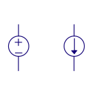
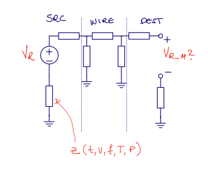
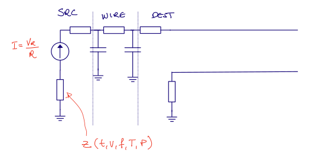
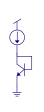
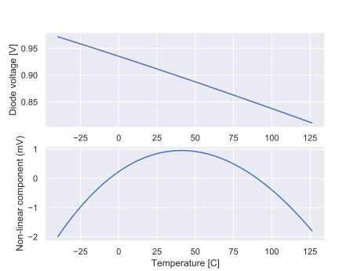

footer: Carsten Wulff 2024
slidenumbers:true
autoscale:true
theme: Plain Jane, 1
text:  Helvetica
header:  Helvetica
date: 2024-01-26

<!--pan_skip: -->

## TFE4188 - Lecture 3
# Reference and bias

---
<!--pan_skip: -->
# Goal for today

Understand **why** we need reference and bias circuits

Introduction to **circuit architectures** 

---
<!--pan_skip: -->

#[fit] Why

---

<!--pan_title: Lecture 3 - References and bias -->

<!--pan_doc:

Keywords: VREf, IREF, VD, BGAP, LVBGAP, VI, GMCELL

<iframe width="560" height="315" src="https://www.youtube.com/embed/ulZnJZIIBUc?si=VBmGeMsLR_UJ8Y7u" title="YouTube video player" frameborder="0" allow="accelerometer; autoplay; clipboard-write; encrypted-media; gyroscope; picture-in-picture; web-share" allowfullscreen></iframe>

In our testbenches, and trial schematics, it's common to include voltage sources and current sources. However, the 
ideal voltage source, or ideal current source does not exist in the real world. There is no such thing.

We can come close to creating a voltage source, a known voltage, with a low source impedance, but not zero impedance.
And it won't be infinitely fast either. If we suddenly decide to pull 1 kA from a lab supply I promise you the voltage will drop. 

So how do we create something that is a _good enough_ voltage and current source on an IC?

-->

---

<!--pan_doc: 

# Routing

Before we take a take a look at the voltage and current source, 
I want you to think about how you would route a current, or a voltage on an IC.

Assume we have a known voltage on our IC. How can we make sure we can share that voltage across an IC? 

A voltage is only defined between two points. There is no such thing as the _voltage at a point on a wire_, nor _voltage in a node_. 
Yes, I know we say that, but it's not right. What we forget is that by _voltage in a node_ we always, always mean _voltage in a node referred to ground_.

We've invented this magical place called _ground_, 
the final resting place of all electrons, and we have agreed that all voltages refer to that point.

As such, when we say "Voltage in node A is 1V", what we actually mean is "Voltage in node A is 1 V referred to ground".

Maybe you now understand why we can't just route a voltage across the IC, 
the _other side_ might not have the same ground. The _other side_
might have a different impedance to ground, and the impedance might 
be a function of time, voltage, frequency temperature, pressure and presence of gremlins.

-->

---

<!--pan_doc:

Most of the time, in order not to think about the ground impedance, we choose to route a known quantity 
as a current instead of a voltage. That means, however,
we must convert from a voltage to a current, but we can do that with a resistor (you'll see later), 
and as long as the resistor is the same on the other side of the IC, 
then we'll know what the voltage is.

-->

<!--pan_doc:

Resistors have finite matching across die, let's say 2 % 3-sigma variation. As a result, if we 
need a accurate voltage reference, then we must distribute voltage.

But how can "It's better to distribute a voltage as a current across the IC, it's more accurate" 
and "If you need something really accurate, you must distribute voltage" both be true?

Imagine I have a 0.5 % 3-sigma accurate voltage reference at 1.22 V, that’s a sigma of 2 mV. 
I need this reference voltage on a block on the other side of the IC, I don’t want to distribute 
voltage, because I don’t know that the ground is the same on the other side, at least not to a precision of 2 mV. 
I convert the voltage into a current, however, I know the R has a 2 % 3-sigma across die, 
so my error budget immediately increases to 2.06%. 

But what if I must have 0.5 % 3-sigma voltage in the block? For example in a battery charger, 
where the 4.3 V termination voltage must be 1 % accurate? 
I have no choice but to go with voltage directly from the reference, but the key point,  is then the receiving block **cannot** be on the other side of the IC. The reference must be right next to my block.

I could use two references on my IC, one for the ADC and one for the battery charger. Ask yourself, “Why do we care if there is two references?” 
And the answer is “Silicon area is  expensive, to make things cheep, we must make things small”,  in other words,  we should not duplicate features unless we absolutely have to.

-->

---

#[fit] Bandgap voltage reference

---

## A voltage complementary to temperature (CTAT)

<!--pan_doc: 
A diode connected bipolar transistor, or indeed a PN diode, 
assuming a fixed current, will have a voltage across that is temperature dependent
-->

 $$ I_D = I_S \left(e^{\frac{V_{BE}}{V_T}} - 1\right)  + I_B \approx I_S e^{\frac{ V_{BE}}{V_T}}$$

<!--pan_doc:

As $I_S$ is much smaller that $I_D$ we can ignore the -1, 
and we assume that the base current is much smaller than the drain current.

Re-arranging for $V_{BE}$ and inserting for 

-->

 $$V_T = \frac{kT}{q}$$

 $$ V_{BE} = \frac{k T}{q} \ln{\frac{I_C}{I_S}}$$
 
 $$I_S = q A n_i^2 \left[\frac{D_n}{L_n N_A} + \frac{D_p}{L_p N_D}\right]$$
 
 
<!--pan_doc: 

From this equation, it looks like the voltage $V_{BE}$ is proportional to temperature

However, it turns out that the $V_{BE}$ decreases with 
temperature due to the temperature dependence of $I_S$.

The $V_{BE}$ is linear with temperature with a property that 
if you extrapolate the $V_{BE}$ line to zero Kelvin, then all diode voltages 
seem to meet at the bandgap voltage of silicon (approx 1.12 eV). 

To see the temperature coefficient, I find it easier to re-arrange the equation above.

-->

---

Some algebra (see [Diodes](https://analogicus.com/aic2024/2023/10/26/Diodes.html))
 
 $$ V_{BE} = \frac{kT}{q}(\ell  - 3 \ln T) + V_G $$ 

<!--pan_doc:

The $\ell$ is a temperature independent constant given by 

--->

 $$ \ell= \ln{I_C} - 
 \ln{qA} - \ln{\left[\frac{D_n}{L_n N_A} + \frac{D_p}{L_p N_D}\right]}
 - 2 \ln{2}
 - \frac{3}{2} \ln{m_n^*} - \frac{3}{2}\ln{m_p^*}
 - 3 \ln{\frac{2 \pi k}{h^2}} $$

---

<!--pan_doc:

And if we plot the diode voltage, we can see that the voltage decreases as a function of temperature.

-->

---

## A current proportional to temperature (PTAT)

<!--pan_doc: 

If we take two diodes, or bipolars, biased at different current densities, as shown in the figure below, then

$$ V_{D1} = V_T \ln{\frac{I_{D}}{I_{S1}}} $$

$$ V_{D2} = V_T \ln{\frac{I_{D}}{I_{S2}}} $$

The OTA will force the voltage on top of the resistor to be equal to $V_{D1}$, thus the voltage across the resistor $R_1$ is 

-->

$$ V_{D1} - V_{D2} = V_T \ln{\frac{I_{D}}{I_{S1}}} - V_T \ln{\frac{I_{D}}{I_{S2}}} = V_T \ln{\frac{I_{S2}}{I_{S1}} }  = V_T \ln N $$

<!--pan_doc:

This is a remarkable result. The difference between two voltages is only defined by boltzmann's constant, 
temperature, charge, and a know size difference.

This differential voltage can be used to read out directly the temperature on an IC, 
provided we have a known voltage to compare with. 

We often call this voltage $\Delta V_D$ or $\Delta V_{BE}$, and we can clearly see it's proportional to absolute temperature. 

We know that the $V_D$ decreases linearly with temperature, so if we combined a multi-plum of the 
$\Delta V_{BE}$ with a $V_D$ voltage, then we should get a constant voltage.

-->

 

---

## How to combine a CTAT with a PTAT ?

---

<!--pan_doc:

One method is the figure below. The voltage across resistor $R_2$ would compensate for the decrease in $V_{D3}$,
as such, $R_2$ would be bigger than $R_1$.

-->

---

<!--pan_doc:

Another method would be to stack the $R_2$ on top of $R_1$ as shown below. 

-->

<!--pan_doc:

-->

---

<!--pan_doc:

## Brokaw reference 

Paul Brokaw was a pioneer within reference circuits. Below is the Brokaw reference, which I think was first published in [A simple three-terminal IC bandgap reference](https://ieeexplore.ieee.org/document/1050532).

-->

 

<!--pan_doc:

The opamp ensures the two bipolars have the same current. $Q_1$ is larger than $Q_2$. 
The $\Delta V_{BE}$ is across the $R_2$, so we know the current $I$. We know that $R_1$ must then have $2I$. 

The voltage at the output will then be.

-->

$$ V_{BG} = V_{G0} + (m-1)\frac{kT}{q}\ln{\frac{T_0}{T}} +T\left[\frac{k}{q}\ln{\frac{J_2}{J_1}}\frac{2R2}{R1} - \frac{V_{G0}- V_{be0}}{T_0}\right] $$

<!--pan_doc:

where $V_{G0}$ is the bandgap, $V_{be0}$ is the base emitter measured at a temperature $T_0$ and the $J$'s are the current densities.

To get a constant output voltage, the relationship between the resistors should be approximately

$$ \frac{R2}{R1} = \frac{V_{G0} - V_{be0}}{2 T_0 \frac{k}{q}\ln(\frac{J_2}{J_1})} $$

-->

---

<!--pan_doc:

In typical simulations, the variation can be  low over the temperature range. The second order error is the remaining error from

$$ V_{BG} = V_{G0} + (m-1)\frac{kT}{q}\ln{\frac{T_0}{T}} +T\left[\frac{k}{q}\ln{\frac{J_2}{J_1}}\frac{2R2}{R1} - \frac{V_{G0}- V_{be0}}{T_0}\right] $$

Where the last term is zero, so 

$$ V_{BG} = V_{G0} + (m-1)\frac{kT}{q}\ln{\frac{T_0}{T}} $$

-->

---

<!--pan_doc: 

Over corners, I do expect that there is variation. It may be that the $V_D$ modeling is not perfect, 
which means the cancellation of the last term is incomplete. 

We could include trimming of PTAT to calibrate for the remaining error, however, if we 
wanted to remove the linear gradient, we would need a two point temperature test of every
IC, which too expensive for low-cost devices.

-->

   

---

##[fit] Low voltage bandgap

---

<!--pan_doc: 

The Brokaw reference, and others, have a 1.2 V output voltage, which is hard if your supply is below about 1.4 V. 
As such, people have investigated lower voltage references. The original circuit was presented by Banba [A CMOS bandgap reference circuit with sub-1-V operation](https://ieeexplore.ieee.org/document/760378)

In real ICs though, you should ask yourself long and hard whether you really need these low-voltage references. 
Most ICs today still have a high voltage, either 1.8 V or 3.0 V. 

If you do need them though, consider the circuit below. We have two diodes at different current densities.
The $\Delta V_D$ will be across $R_1$. The voltage at the input of the OTA will be $V_D$ 
and the OTA will ensure the both are equal. 

The current will then be 

$$ I_1 = \frac{\Delta V_{D}}{R_1}$$

and we know the current increases with temperature, since $\Delta V_D$ increases with temperature.

-->

 

---

<!--pan_doc: 

In the figure below I've used $\Delta V_{BE}$, it's the same as $\Delta V_{D}$, so ignore that error.

Assume we copy the $V_D$ to another node, and place it across a second resistor $R_2$, as shown in the figure below.
The current in this second resistor is then 

$$ I_2 = \frac{V_D}{R_2}$$

and we know the current decreases with temperature, since $V_D$ decreases with temperature.

From before, we know the current in $R_1$ is proportional to temperature. As such, 
if we combine the two with the correct proportions, then we can get a current that does not change with temperature.

-->

 

---

<!--pan_doc:

Let's remove the OTA, and connect $R_2$ directly to $V_D$ nodes, you should convince yourself 
of the fact that this does not change $I_1$ at all. 

-->

 

<!--pan_doc:

It does, however, change the current in the PMOS.
Provided we scale $R_2$ correctly, then the PTAT $I_1$ can be compensated by the CTAT $I_2$, 
and we have a current that is independent of temperature. 

-->

$$ I_{PMOS} = \frac{V_D}{R_2} + \frac{\Delta V_D}{R_1}$$

---

<!--pan_doc:

Assuming we copy the current into another resistor $R_3$, as shown below, we can get a voltage that is 

$$ V_{OUT} = R_3\left[\frac{V_D}{R_2} + \frac{\Delta V_D}{R_1}\right]$$

Where the output voltage can be chosen freely, and indeed be lower than 1.2 V.

-->

 

---

#[fit] Bias

 Sometimes we just need a current 

---

## How does a VI converter circuit work?

<!--pan_doc: 

With a known voltage, we can convert to a known current with the circuit below. 

On-chip we don't have accurate resistors, 
but for bias currents, it's usually ok with $+- 20 %$ variation  (the variation of R). 

Across a IC, we can expect the resistors to match within a few percent, as such, we can recreate a 
voltage with a accuracy of a few percent difference from the original if we have a second resistor on the other side of the IC.

If we wanted to create an accurate current, then we'd trim the R until the current is what we want. 

-->

---

## GmCell: Why is 1/Z proportional to transistor transconductance?

<!--pan_doc: 

Sometimes we don't need a full bandgap reference. In those cases, we can use a GM cell, where the impedance could be a resistor, in which case

$$ V_o = V_{GS1}  - V_{GS2}  = V_{eff1} + V_{tn} - V_{eff2} - V_{tn} = V_{eff1} - V_{eff2}$$

Assuming strong inversion, then 

$$ I_{D1} = \frac{1}{2} \mu_n C_{ox} \frac{W_1}{L_1} V_{eff1}^2 $$ 

$$ I_{D2} = \frac{1}{2} \mu_n C_{ox} 4 \frac{W_1}{L_1} V_{eff2}^2 $$ 

$$ I_{D1} = I_{D2} $$

$$ \frac{1}{2} \mu_n C_{ox} \frac{W_1}{L_1} V_{eff1}^2 = \frac{1}{2} \mu_n C_{ox} 4 \frac{W_1}{L_1} V_{eff2}^2 $$

$$ V_{eff1} = 2 V_{eff2} $$

Inserted into above

$$V_o = V_{eff1} - \frac{1}{2} V_{eff1} = \frac{1}{2}V_{eff1}$$

Still assuming strong inversion, such that

$$ g_{m} = \frac{2 I_d}{V_{eff}} $$

we find that

$$ I = \frac{ V_{eff1}}{2Z} $$

$$ Z \Rightarrow \frac{1}{g_m} $$

If we use a resistor for Z, then we can get a transconductance that is proportional to a resistor, or a constant $g_{m}$ bias.

We can use other things for Z, like  a switched capacitor

-->

---

---

#[fit] Thanks!

---
