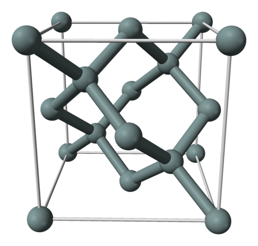
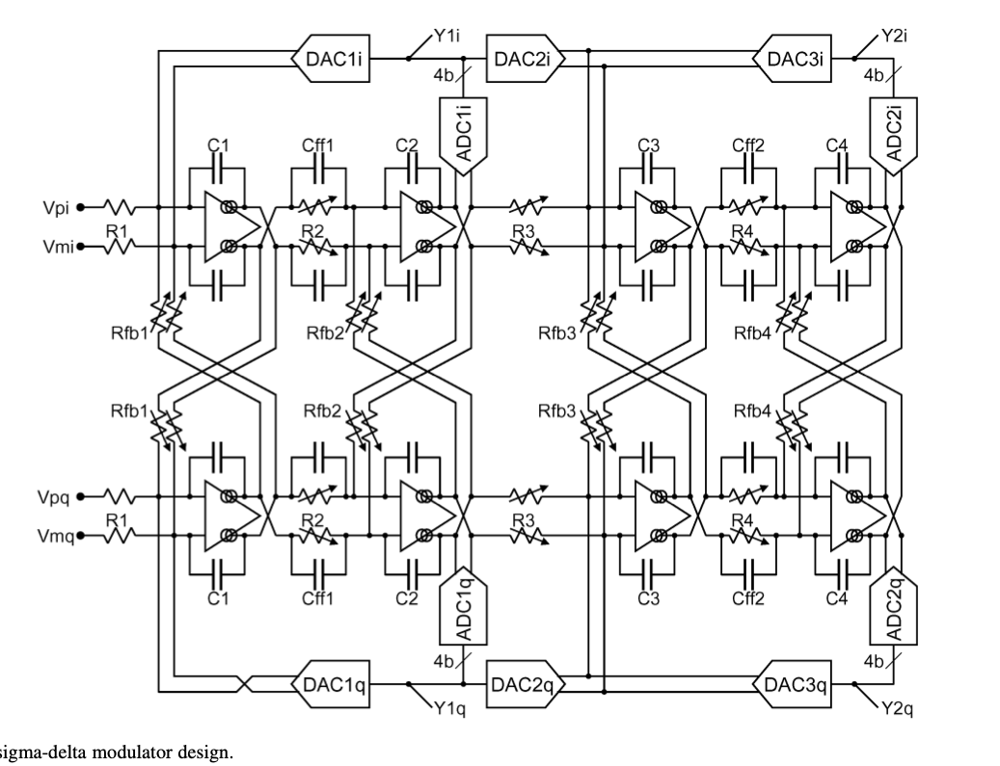
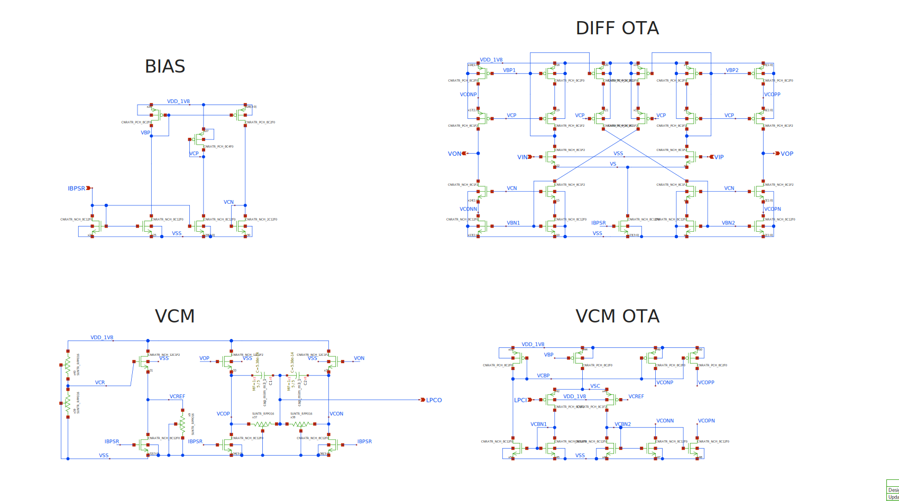

footer: Carsten Wulff 2024
slidenumbers:true
autoscale:true
theme: Plain Jane, 1
text:  Helvetica
header:  Helvetica
date: 2024-02-01

<!--pan_skip: -->
## TFE4188 - Lecture 4
# Analog frontend and filters
---

<!--pan_skip: -->

#[fit] Why

---

<!--pan_skip: -->

The behavior of particles is written in the mathematics of quantum mechanics

$$\psi(x,t) = Ae^{j(kx - \omega t)}$$
Probability amplitude of a particle

$$ \frac{1}{2 m} \frac{\hbar}{j^2} \frac{\partial^2}{\partial^2 x}\psi(x,t) +
U(x)\psi(x,t) = -\frac{\hbar}{j}\frac{\partial}{\partial t} \psi(x,t)$$
Time evolution of the energy of a particle[^2]

$$ \frac{n_n}{n_p} = \frac{e^{(E_{p} - \mu) / kT} + 1}{e^{(E_{n} - \mu) /
kT} + 1}  $$
Relates the average number of fermions in thermal equlilibrium to the
energy of a single-particle state[^3] 

[^2]: [Schrödinger equation](https://en.wikipedia.org/wiki/Schrödinger_equation)

[^3]: [Fermi-Dirac statistics](https://en.wikipedia.org/wiki/Fermi–Dirac_statistics)

---

<!--pan_skip: -->

The world is analog and is written in the mathematics of calculus [^1] 

$$ \oint_{\partial \Omega} \mathbf{E} \cdot d\mathbf{S} = \frac{1}{\epsilon_0} \iiint_{V} \rho
\cdot dV$$  
Relates net electric flux to net enclosed electric charge

$$ \oint_{\partial \Omega} \mathbf{B} \cdot d\mathbf{S} = 0$$
Relates net magnetic flux to net enclosed magnetic charge

$$ \oint_{\partial \Sigma} \mathbf{E} \cdot d\mathbf{\ell} = - \frac{d}{dt}\iint_\Sigma \mathbf{B}
\cdot d\mathbf{S}$$
Relates induced electric field to changing magnetic flux

$$ \oint_{\partial \Sigma} \mathbf{B} \cdot d\mathbf{\ell} = \mu_0\left(
\iint_\Sigma \mathbf{J} \cdot d\mathbf{S} + \epsilon_0 \frac{d}{dt}\iint_\Sigma
\mathbf{E} \cdot d\mathbf{S} \right)$$
Relates induced magnetic field to changing electric flux and to current

[^1]: [Maxwell's equations](https://en.wikipedia.org/wiki/Maxwell%27s_equations)

---

<!--pan_skip: -->

[.table-separator: #000000, stroke-width(1)] 
[.table: margin(8)]

The abstract digital world is written in the mathematics of boolean algebra[^4]

$$ 1 = \text{True} $$, $$ 0 = \text{False} $$

| A | B | NOT(A AND B) |
|:---|:---|:---|
| 0 | 0 | 1 |
| 0 | 1 | 1 |
| 1 | 0 | 1 |
| 1 | 1 | 0 |

All digital processing can be made with the NOT(A AND B) function!

[^4]: [Boolean algebra](https://en.wikipedia.org/wiki/Boolean_algebra)

---

<!--pan_skip: -->

# People that make digital circuits can easily reuse the work of others

---

<!--pan_skip: -->

#  People that make analog circuits can learn from others, but need to deal with the real world on their own

---

<!--pan_skip: -->

### Should we do as much as possible in the abstract digital world? 

 

---

<!--pan_title: Lecture 4 - Analog frontend and filters -->

<!--pan_doc: 

<iframe width="560" height="315" src="https://www.youtube.com/embed/hLqhCmKismc?si=d6e-4ePUVaknmAQz" title="YouTube video player" frameborder="0" allow="accelerometer; autoplay; clipboard-write; encrypted-media; gyroscope; picture-in-picture; web-share" allowfullscreen></iframe>

# Introduction

The world is analog, and these days, we do most signal processing in the digital domain. 
With digital signal processing we can reuse the work of others, buy finished IPs, 
and probably do processing at lower cost than for analog.

Analog signals, however, might not be suitable for conversion to digital. A sensor might have a high, or low impedance, and have the signal in the voltage, current, charge 
or other domain.

To translate the sensor signal into something that can be converted to digital we use 
analog front-ends (AFE). How the AFE looks will depend on application, but it's common 
to have amplification, frequency selectivity or domain transfer, for example current to voltage.

An ADC will have a sample rate, and will alias (or fold) any signal above half the sample rate, as such, 
we also must include a anti-alias filter in AFE that reduces any signal outside the bandwidth of the ADC as 
close to zero as we need.

-->

---

<!--pan_doc:

One example of an analog frontend is the recieve chain of a typical bluetooth radio. The signal
that arrives at the antenna, or the "sensor", can be  weak, maybe -90 dBm.

At the same time, at another frequency, there could be a unwanted signal, or blocker,  of -30 dBm

Assume for the moment we actually 
used an ADC at the antenna, how many bits would we need?

Bluetooth uses Gaussian Frequency Shift Keying, which is a constant envelope binary modulation, and it's ususally sufficient with low number of bits, assume 8-bits for the signal is more than enough.

If we assume the maximum of the ADC should be the blocker in the table below, and the resolution of the digital should be given by

-->

| What | Power [dBm] | Voltage [V]  |
|----|----|---|---|
|Blocker| -30 |  7 m |
|Wanted | -90 |  7 u|
|Resolution|  | Wanted/255 = 28 n|

<!--pan_doc:

Then we can calculate the number of bits as

-->

$$ \text{ ADC resolution }\Rightarrow  \ln{ \frac{7 \text{ mV}}{28 \text{ nV}} }/\ln{2} \approx 18 \text{ bits}$$ 

<!--pan_doc:

If we were to sample at 5 GHz, to ensure the bandwidth is sufficient for a 2.480 GHz 
maximum frequency we can actually compute the power consumption.

Given the Walden figure of merit of

-->

---

$$FOM = \frac{P}{2^{ENOB}fs}$$

<!--pan_doc:

The best FOM in literature is about 1 fJ/step, so 

-->

$$P = 1\text{ fJ/step} \times 2^{18} \times 5\text{GHz} = 1.31\text{ W}$$

<!--pan_doc:

If we look at a typical system, like the [Whoop](https://www.whoop.com/eu/en/). We can have a look at teardowns, to find the battery size.
-->

[Whoop battery](https://fccid.io/2AJ2X-WS30/Internal-Photos/Internal-Photos-4265037.pdf) is 205mAh at 3.8 V

<!--pan_doc:

Then we can compute the lifetime running an ADC based Bluetooth Radio

-->

$$\text{ Hours} = \frac{ 205 \text{ mAh}}{1.32\text{ W}/3.8\text{ V}} = 0.6\text{ h}$$

<!--pan_doc:

I know my whoop lasts for almost a week, so it can't be what Bluetooth ICs do.

I know a little bit about radio's, especially inside the Whoop, since it has 

-->
[Nordic Inside](https://www.nordicsemi.com/Nordic-news/2022/07/the-whoop-4-uses-nordics-nrf52840-soc)

<!--pan_doc:

I can't tell you how the Nordic radio works, but I can tell you how others usually make their radio's. The typical radio below has multiple blocks in the AFE. 

-->

---

<!--pan_doc:

First is low-noise amplifier (LNA) amplifying the signal by maybe 10 times. The LNA reduces 
the noise impact of the following blocks. The next is the complex mixer stage, which shifts the input signal from radio frequency
down to a low frequency, but higher than the bandwidth of the wanted signal. Then there is a complex anti-alias filter, also
called a poly-phase filter, which rejects parts of the unwanted signals. Lastly there is a complex ADC to convert to digital.

In digital we can further filter to select exactly the wanted signal. Digital filters can have high stop band attenuation
at a low power and cost. There could also be digital mixers to further reduce the frequency.

The AFE  makes the system more efficient. In the 5 GHz ADC output, from the example 
above, there's lot's of information that we don't use.

An AFE can reduce the system power consumption by constraining digital information processing and conversion to 
the parts of the spectrum with information of interest.

There are instances, though, where the full 2.5 GHz bandwidth has useful information. Imagine in a cellular base station
that should process multiple cell-phones at the same time. In that case, it could make sense with an ADC at the antenna. 

What make sense depends on the application.

-->

---
<!--pan_skip:-->

##[fit] You must know application before you make the AFE!

---

#[fit] Filters

<!--pan_doc: 

A filter can be fully described by the transfer function, usually denoted by $H(s) = \frac{\text{output}}{\text{input}}$.

Most people will today start design with a high-level simulation, in for example Matlab, or Python. 
Once they know roughly the transfer function, they will implement the actual analog circuit.

For us, as analog designers, the question becomes "given an $H(s)$, how do we make an analog circuit?"
It can be shown that a combination of 1'st and 2'nd order stages can synthesize any order filter. 

Once we have the first and second order stages, we can start looking into circuits. 

-->

---

<!--pan_skip:-->

# [fit] A combination of 1'st and 2'nd order stages can synthesize any order filter

---

## First order filter

<!--pan_doc: 

In the book they use signal flow graphs to show how the first order stage can be generated. By selecting the coefficients $k_0$
,$k_1$ and $\omega_0$ we can get any first order filter, and thus match the $H(s)$ we want.

I would encourage you to try and derive from the signal flow graph the $H(s)$ and prove to your self the equation is correct.

-->

<!--pan_doc:

Signal flow graphs are useful when dealing with linear systems. 

The instructions to compute the transfer functions are

-->

1. any line with a coefficient is a multiplier
1. any box output is a multiplication of the coefficient and the input 
1. any sum, well, sum all inputs
1. be aware of gremlins (a sudden -+ swap)

$$ H(s) =\frac{V_o(s)}{V_i(s)}  = \frac{ k_1 s + k_0 }{s + w_o}$$

<!--pan_doc:

Let's call the $1/s$ box input $u$

$$u = (k_0 + k_1s)V_i - \omega_0 V_o$$

$$ V_o = u/s $$

$$ u = V_o s = (k_0 + k_1s)V_i - \omega_0 V_o$$

$$ (s + \omega_0)V_o = (k_0 + k_1s)V_i$$

$$ \frac{V_o}{V_i} = \frac{k_1s + k_0}{s + \omega_0}$$

-->

---
## Second order filter 

Bi-quadratic is a general purpose second order filter.

<!--pan_doc: 

Bi-quadratic just means "there are two quadratic equations". Once we match the $k$'s $\omega_0$ and $Q$ 
to our wanted $H(s)$ we can proceed with the circuit implementation.

-->

 $$ H(s) = \frac{k_2 s^2 + k_1 s + k_0}{s^2 + \frac{\omega_0}{Q} s +
 \omega_o^2}$$

<!--pan_doc:

Follow exactly the same principles as for first order signal flow graph. If you fail, and you can't find the problem with your algebra, then maybe
you need to use Maple or Mathcad.

I guess you could also spend hours training on examples to get better at the algebra. Personally I find such tasks mind numbingly boring, and of little value.
What's important is to remember that you can always look up the equation for a bi-quad in a book.

-->

---

 
## How do we implement the filter sections?

<!--pan_doc: 

While I'm sure you can invent new types of filters, and there probably are advanced filters, I would say there is roughly three types.
Passive filters, that do not have gain. Active-RC filters, with OTAs, and usually trivial to make linear. And Gm-C filters,
where we use the transconductance of a transistor and a capacitor to set the coefficients. Gm-C are usually more power efficient
than Active-RC, but they are also more difficult to make linear. 

In many AFEs, or indeed Sigma-Delta modulator loop filters, it's common to find a first Active-RC stage, and then
Gm-C for later stages. 

-->

---

#[fit] Gm-C

---

<!--pan_doc:

In the figure below you can see a typical Gm-C filter and the equations for the transfer function. One important thing to note
is that this is Gm with capital G, not the $g_m$ that we use for small signal analysis. 

In a Gm-C filter the input and output nodes can have significant swing, and thus cannot always be considered small signal.

-->

$$ V_o = \frac{I_o}{s C} = \frac{\omega_{ti}}{s} V_i $$

$$ \omega_{ti} = \frac{G_m}{C}$$

---

<!--pan_doc:

## Differential Gm-C

In a real IC we would almost always use differential circuit, as shown below. The transfer function is luckily the same. 

-->

$$ s C V_o = G_m Vi $$

$$ H(s) = \frac{V_o}{V_i} = \frac{G_m}{sC}$$

---

<!--pan_doc:

Differential circuits are fantastic for multiple reasons, power supply rejection ratio, noise immunity, symmetric non-linearity, but
the qualities I like the most is that the outputs can be flipped to implement negative, or positive gain.

-->

$$ H(s) = \frac{V_o}{V_i} = -\frac{G_m}{sC}$$

---

<!--pan_doc: 

The figure below shows a implementation of a first-order Gm-C filter that matches our signal flow graph. 

I would encourage you to try and calculate the transfer function.

-->

<!--pan_doc: 

Given the transfer function from the signal flow graph, we see that we can select $C_x$, $C_a$ and $G_m$ to get the desired
$k$'s and $\omega_0$

-->

$$ H(s) = \frac{ k_1 s + k_0 }{s + w_o}$$
 
$$ H(s) = \frac{s \frac{C_x}{C_a + C_x} + \frac{G_{m1}}{C_a + C_x}}{s +
 \frac{G_{m2}}{C_a + C_x}}$$

---

<!--pan_doc:

Below is a general purpose Gm-C bi-quadratic system. 

-->

$$ H(s) = \frac{k_2 s^2 + k_1 s + k_0}{s^2 + \frac{\omega_0}{Q} s +
 \omega_o^2}$$

$$ H(s) = \frac{ s^2\frac{C_X}{C_X + C_B} + s\frac{G_{m5}}{C_X + C_B} + \frac{G_{m2}G_{m4}}{C_A(C_X + C_B)}}
{s^2 + s\frac{G_{m2}}{C_X + C_B} + \frac{G_{m1}G_{m2}}{C_A(C_X + C_B)} }$$

---

<!--pan_doc:

## Finding a transconductor

Although you can start with the Gm-C cells in the book, I would actually choose to look at a few papers first.

The main reason is that any book is many years old. Ideas turn into papers, papers turn into books, and by the time 
you read the book, then there might be more optimal circuits for the technology you work in. 

If I were to do a design in 22 nm FDSOI I would first see if someone has already done that, and take a look at the
strategy they used. If I can't find any in 22 nm FDSOI, then I'd find a technology close to the same supply voltage.

Start with [IEEEXplore](https://ieeexplore.ieee.org/search/searchresult.jsp?queryText=Gm-C&highlight=true&returnType=SEARCH&matchPubs=true&sortType=newest&returnFacets=ALL&refinements=PublicationTitle:IEEE%20Journal%20of%20Solid-State%20Circuits)

I could not find a 22 nm FDSOI Gm-C based circuit on the initial search. If I was to actually make a Gm-C circuit for industry
I would probably spend a bit more time to see if any have done it, maybe expanding to other journals or conferences. 

I know of [Pieter Harpe](https://scholar.google.nl/citations?user=nLhKSsMAAAAJ&hl=nl), and his work is usually superb, 
so I would take a closer look at [A 77.3-dB SNDR 62.5-kHz Bandwidth Continuous-Time Noise-Shaping SAR ADC With Duty-Cycled Gm-C Integrator](https://ieeexplore.ieee.org/document/9989513)

And from Figure 10 a) we can see it's a similar Gm-C cell as chapter 12.5.4 in CJM. 

One of my Ph.d's used the transonductor below on his master thesis [Design Considerations for a Low-Power Control-Bounded A/D Converter](https://ntnuopen.ntnu.no/ntnu-xmlui/handle/11250/2824253).

-->

---

#[fit] Active-RC

<!--pan_doc: 

The Active-RC filter should be well know at this point. However, what might be new is that the open loop gain $A_0$ and unity gain
$\omega_{ta}$ 

-->

---

## General purpose first order filter

<!--pan_doc:

Below is a general purpose first order filter and the transfer function. I've used the condutance $G = \frac{1}{R}$ instead of the resistance. The reason
is that it sometimes makes the equations easier to work out. 

If you're stuck on calculating a transfer function, then try and switch to conductance, and see if it resolves.

I often get my mind mixed up when calculating transfer functions. I don't know if it's only me, but if it's you also, then don't worry,
it's not that often you have to work out transfer functions. 

Once in a while, however, you will have a problem where you 
must calculate the transfer function. Sometimes it's because you'll need to understand where the poles/zeros are in a circuit, or
you're trying to come up with a clever idea, or I decide to give this exact problem on the exam.

-->

$$ H(s) = \frac{ k_1 s + k_0 }{s + w_o}$$

$$ H(s) = \frac{  -\frac{C_1}{C_2}s -\frac{G_1}{ C_2}}{s + \frac{G_2}{ C_2}}$$

<!--pan_doc: 

Let's work through the calculation. 

### Step 1: Simplify 
The conductance from $V_{in}$ to virtual ground can be written as

$G_{in} = G_1 + sC_1$

The feedback conductance, between $V_{out}$ and virtual ground I write as 

$G_{fb} = G_2 + sC_2$

### Step 2: Remember how an OTA works
An ideal OTA will force its inputs to be the same. As a result, the potential at OTA$-$ input must be 0. 

The input current must then be 

$I_{in} = G_{in} V_{in}$

Here it's important to remember that there is no way for the input current to enter the OTA. The OTA is high impedance. The input 
current must escape through the output conductance $G_{fb}$. 

What actually happens is that the OTA will change the output voltage $V_{out}$ until the feedback current
, $I_{fb}$, exactly matches $I_{in}$. That's the only way to maintain the virtual ground at 0 V. If the currents do not match, 
the voltage at virtual ground cannot continue to be 0 V, the voltage must change.

### Step 3: Rant a bit

The previous paragraph should trigger your spidy sense. Words like "exactly matches" don't exist in the real world. 
As such, how closely the currents match must affect the transfer function. The open loop gain $A_0$ of the OTA matters. 
How fast the OTA can react to a change in voltage on the virtual ground, approximated by the unity-gain frequency $\omega_{ta}$ 
(the frequency where the gain of the OTA equals 1, or 0 dB), matters. The input impedance of the OTA, whether the gate 
leakage of the input differential pair due to quantum tunneling, or the capacitance of the input differential pair, matters. How much
current the OTA can deliver (set by slew rate), matters. 

Active-RC filter design is  "How do I design my OTA so it's good enough for the filter". That's also why, for integrated circuits,
you will not have a library of OTAs that you just plug in, and they work. 

I would be very suspicious of working anywhere that had an OTA library I was supposed to use for integrated filter design. 
I'm not saying it's impossible that some company actually has an OTA library, but I think it's a bad strategy. First of all, 
if an OTA is generic enough to be used "everywhere", then the OTA is likely using too much power, consumes too much area, 
and is too complex. And the company runs the risk that the designer have not really checked that the OTA works porperly 
in the filter because "Someone else designed the OTA, I just used in my design". 

But, for now, to make our lifes simpler, we assume the OTA is ideal. That makes the equations pretty, and we know what 
we should get if the OTA actually was ideal. 

### Step 4: Do the algebra

The current flowing from $V_{out}$ to virtual ground is 

$$I_{out}= G_{fb}V_{out}$$

The sum of currents into the virtual ground must be zero

$$ I_{in} + I_{out} = 0$$

Insert, and do the algebra 

$$ G_{in}V_{in} + G_{out}V_{out} = 0$$

$$ \Rightarrow - G_{in} V_{in} = G_{out} V_{out}$$

$$ \frac{V_{out}}{V_{in}} = - \frac{G_{in}}{G_{out}}$$

$$ = - \frac{ G_1 + s C_1 }{G_2 + sC_2}$$

$$ = \frac{ -s \frac{C_1}{C_2} - \frac{G_1}{C_2} }{s + \frac{G_2}{C_2}}$$

-->

---
## General purpose biquad 

<!--pan_doc:

A general bi-quadratic active-RC filter is shown below. These kind of general purpose filter sections are quite useful.

Imagine you wanted to make a filter, any filter. You'd decompose into first and second order sections, and then you'd try and match the transfer functions to the general equations. 

-->

<!--pan_doc:

-->

$$ H(s) = \frac{k_2 s^2 + k_1 s + k_0}{s^2 + \frac{\omega_0}{Q} s +
 \omega_o^2}$$

$$H(s) = \frac{\left[ \frac{C_1}{C_B}s^2 + \frac{G_2}{C_B}s + (\frac{G_1G_3}{C_A C_B})\right]}{\left[ s^2  + \frac{G_5}{C_B}s + \frac{G_3 G_4}{C_A C_B}\right]}$$

---

# The OTA is not ideal

 
 $$ H(s) \approx \frac{A_0}{(1 + s A_o R C)(1 + \frac{s}{w_{ta}})}$$
 
 where $$A_0$$ is the gain of the amplifier, and $$\omega_{ta}$$ is the unity-gain frequency.
 
 
 
<!--pan_doc:

At frequencies above $\frac{1}{A_0RC}$ and below $w_{ta}$ the circuit above is a good approximation of an ideal integrator. 

See page 511 in CJM (chapter 5.8.1)

# Example circuit

One place where both active-RC and Gm-C filters find a home are continuous time sigma-delta modulators. More on SD later, for now,
just know that SD us a combination of high-gain, filtering, simple ADCs and simple DACs to make high resolution analog-to-digital converters.

One such an example is 
-->

---

[A 56 mW Continuous-Time Quadrature Cascaded Sigma-Delta Modulator With 77 dB DR in a Near Zero-IF
20 MHz Band](https://ieeexplore.ieee.org/stamp/stamp.jsp?tp=&arnumber=4381437)

<!--pan_doc:

Below we see the actual circuit. It may look complex, and it is. 

Not just "complex" as in complicated circuit, it's also "complex" as in "complex numbers".

We can see there are two paths "i" and "q", for "in-phase" and "quadrature-phase". The fantasitc thing about complex ADCs is that we 
can have a-symmetric frequency response around 0 Hz. 

It will be tricky understanding circuits like this in the beginning, but know that it is possible, and it does get easier to understand.

With a complex ADC like this, the first thing to understand is the rough structure.

There are two paths, each path contains 2 ADCs connected in series (Multi-stage Noise-Shaping or MASH). Understanding everything at once does not make sence. 

Start with "Vpi" and "Vmi", make it into a single path (set Rfb1 and Rfb2 to infinite), ignore what happens after R3 and DAC2i. 

Now we have a continuous time sigma delta with two stages. First stage is a integrator (R1  and C1), and second stage is a filter (Cff1, R2 and C2). The amplified and filtered signal 
is sampled by the ADC1i and fed back to the input DAC1i. 

It's possible to show that if the gain from $V(Vpi,Vpm)$ to ADC1i input is large, then $Y1i = V(Vpi,Vpm)$ at low frequencies.

-->

 

---

# My favorite OTA

<!--pan_doc:

Over the years I've developed a love for the current mirror OTA. A single stage, with load compensation, and an adaptable range of DC gains. 

Sometimes simple current mirrors are sufficient, sometimes cascoded, or even active cascodes are necessary. 

Below is the differential current mirror OTA. 

-->

---

<!--pan_doc:

In a differential OTA we need to control the output common mode. In order to control the common mode, we must sense the common mode.

Below is a circuit I often use to sense the common mode. Ideally the source followers would be native transistors, but those are not always available. 

The reference for the common mode can be from a bandgap, or in the case below, VDD/2.

-->

---

---

<!--pan_doc:

Once we have both the sensed common mode, and the common mode reference, we can use another OTA to control the common mode. 

The nice thing about the circuit below is that the common mode feedback loop has the same dominant pole as the differential loop.

-->

---

<!--pan_doc:

You can find the schematic for the OTA at 
-->

[CNR\_OTA\_SKY130NM](https://github.com/wulffern/cnr_ota_sky130nm)

---

#[fit] Thanks!

---
