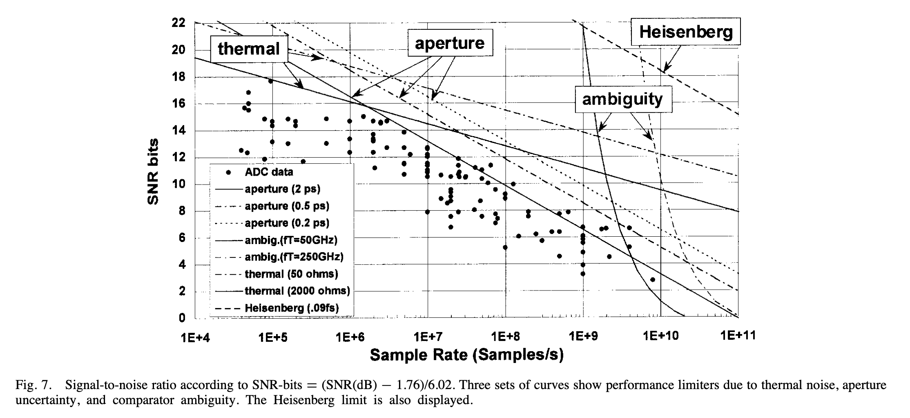
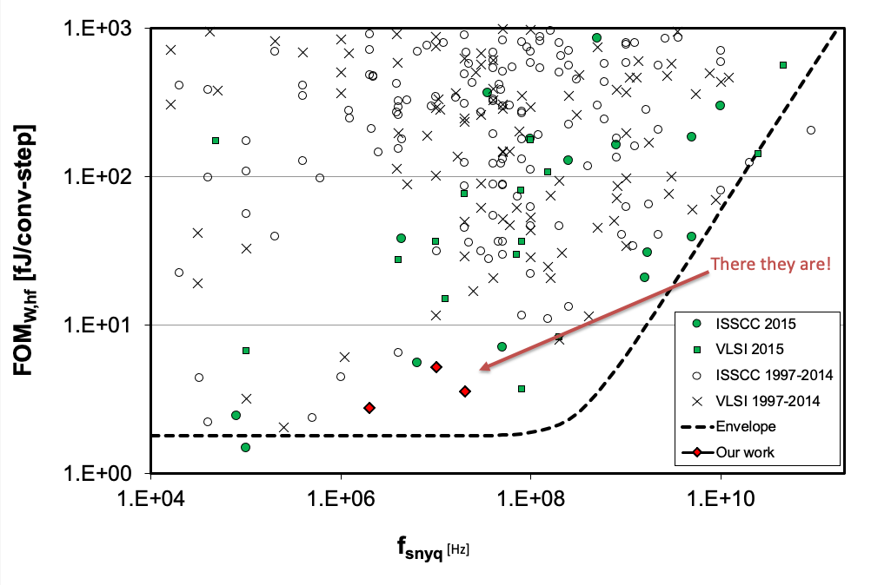
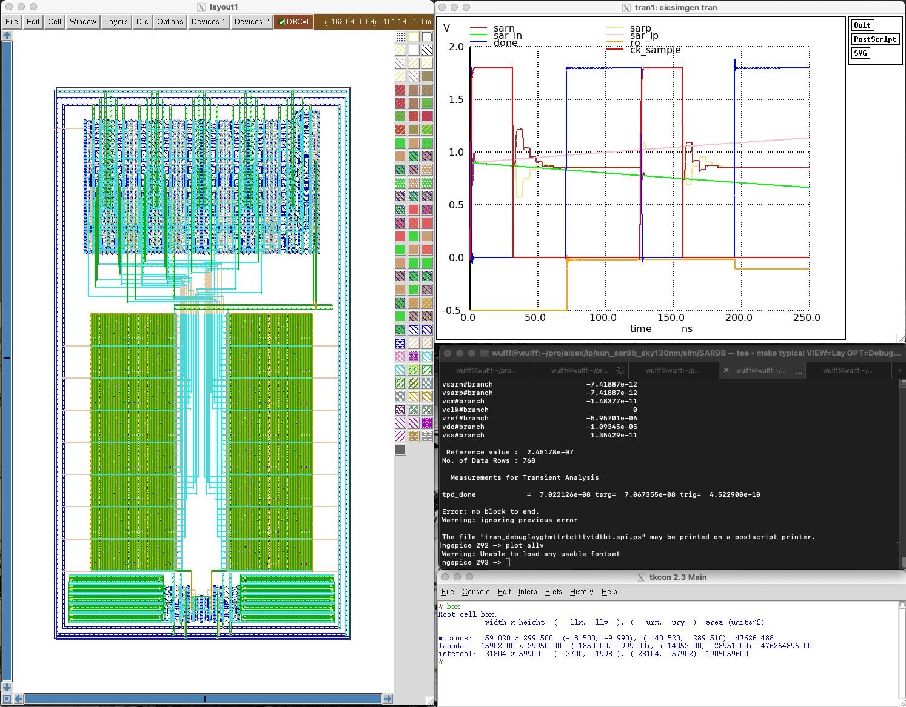
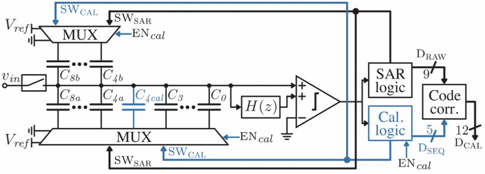
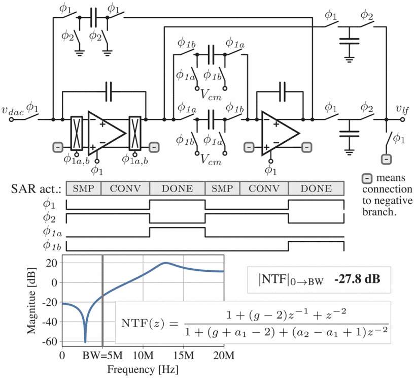

footer: Carsten Wulff 2024
slidenumbers:true
autoscale:true
theme: Plain Jane, 1
text:  Helvetica
header:  Helvetica
date: 2024-02-16


<!--pan_skip: -->

## TFE4188 - Lecture 6
# Oversampling and Sigma-Delta ADCs

<!--pan_title: Lecture 6 - Oversampling and Sigma-Delta ADCs -->

---

<!--pan_doc:

<iframe width="560" height="315" src="https://www.youtube.com/embed/fdczPHW4jis?si=kqpoggmr_IYkrrs4" title="YouTube video player" frameborder="0" allow="accelerometer; autoplay; clipboard-write; encrypted-media; gyroscope; picture-in-picture; web-share" allowfullscreen></iframe>

-->

<!--pan_skip: -->

## Goal for today

Understand **why** there are different ADCs

Introduction to **oversampling** and  **delta-sigma** modulators

A few **examples**

---

<!--pan_doc:

# ADC state-of-the-art

The performance of an analog-to-digital converter is determined by the effective number of bits (ENOB), the power consumption, and the maximum bandwidth. 
The effective number of bits contain information on the linearity of the ADC. The power consumption shows 
how efficient the ADC is. The maximum bandwidth limits what signals we can sample and reconstruct in
digital domain.

Many years ago, Robert Walden did a study of ADCs, one of the plot's is shown below.
-->

[1999, R. Walden: Analog-to-digital converter survey and analysis](https://ieeexplore.ieee.org/stamp/stamp.jsp?tp=&arnumber=761034)

<!--pan_doc:
There are obvious trends, the faster an ADC is, the less precise the ADC is ( lower SNDR). There are also fundamental limits, Heisenberg tells us that a 20-bit 10 GS/s ADC is 
impossible, according to Walden. 


-->



---
<!--pan_doc:

The uncertainty principle states that the precision
we can determine position and the momentum of a particle is
$$\sigma_x \sigma_p \ge \frac{\hbar}{2}$$. There is a similar relation of energy and time, given by 
$$\Delta E \Delta t > \frac{h}{2 \pi}$$
where $\Delta E$ is the difference in energy, and $\Delta t$ is the difference in time. 

You should take these limits with a grain of salt. The plot assumes 50 Ohm and 1 V full-scale. 
As a result, the "Heisenberg" line that appears to be unbreakable certainly is breakable. Just change the voltage to 
100 V, and the number of bits can be much higher. Always check the assumptions. 

A more recent survey of ADCs comes from Boris Murmann. He still maintains a list of the best ADCs from ISSCC and VLSI Symposium.

-->
[B. Murmann, ADC Performance Survey 1997-2023](https://github.com/bmurmann/ADC-survey)

<!--pan_doc:

A common figure of merit for low-to-medium resolution ADCs is the Walden figure of merit, defined as 

-->

$$ FOM_W = \frac{P}{2^B f_s}$$ 

Below 10 fJ/conv.step is good.

Below 1 fJ/conv.step is extreme.

<!--pan_doc:

In the plot below you can see the ISSCC and VLSI ADCs. 

-->

 

---

<!--pan_doc:

## What makes a state-of-the-art ADC

-->

People from NTNU have made some of the worlds best ADCs

<!--pan_doc:


If you ever want to make an ADC, and you want to publish the measurements, then you must be better than most. 
A good algorithm for state-of-the-art ADC design is to first pick a sample rate with low number of data (blank spaces in the plot above), then read the papers in the vicinity of the blank space
to understand the application, then set a target FOM which is best in world, then try and find a ADC architecture that can achieve that FOM. 

That's pretty much the algorithm I, and others, have followed to make state-of-the-art ADCs. A few of the NTNU ADCs are:

-->

[1] [A Compiled 9-bit 20-MS/s 3.5-fJ/conv.step SAR ADC in 28-nm FDSOI for Bluetooth Low Energy Receivers](https://ieeexplore.ieee.org/document/7906479)

[2] [A 68 dB SNDR Compiled Noise-Shaping SAR ADC With On-Chip CDAC
Calibration](https://ieeexplore.ieee.org/document/9056925)


 

---
[.background-color: #000000]
[.text: #FFFFFF]

<!--pan_skip: -->

## What makes a state-of-the-art ADC

---

<!--pan_doc:

In order to publish, there must be something new. Preferably a new circuit. 
Below is the circuit from [1]. It's a standard successive-approximation register (SAR) analog-to-digital converter. 

The differential input signal is sampled on a capacitor array where the bottom plate is connected to either VSS or VREF. Once the voltage is sampled,
the comparator will decide whether the differential voltage is larger, or smaller than 0.  Depending on the decision, the MSB capacitors (left-most) in figure
will switch the bottom plate in order to effectively subtract a voltage equivalent to half the VREF voltage. 

The comparator makes another decision, and 1/4'th the VREF voltage is subtracted or added. Then 1/8'th and so on implementing a binary search 
to find the input voltage. 

The "bit-cycling" (binary-search) loop is self-timed, as such, when the comparator has made a decision, the next cycle starts.

In (b) we can see the enable flip-flop for the next stage. The CK bar is the sample clock, as such, 
A is high during sampling. The output of the comparator (P and N) is low. 

As soon as the comparator makes a decision, P or N goes high, A will be pulled low, if EI is enabled. 

In (c) we can see that the bottom plate of the capacitors $D_{P0}$, $D_{P1}$, $D_{N0}$, and $D_{N1}$, are controlled by P and N. 

In (d) we can see that the bottom plate of the capacitors also used to set the comparator clock low again (CO), resetting the comparator, and 
pulling P and N low, which in (b) enables the next SAR logic state. 

How fast the $D_{XX}$ settle depend on the size of the capacitors, as such, the comparator clock will be slow for the MSB, and very fast for the LSB. 
This was my main circuit contribution in the paper. I think it's quite clever, because both the VDD and the capacitor corner will change the 
settling time. It's important that the capacitor values fully settle before the next comparator decision, and as a result of the circuit in (c,d) the delay
is automatically adjusted. 

For further details see the paper. 

-->


---

<!--pan_doc: 

For state-of-the-art ADC papers it's not sufficient with the idea, and simulation. There must be proof that it actually works. 
No-one will really believe that the ADC works until there is measurements of an actual taped out IC. 

Below you can see the layout of the IC I made for the paper. Notice that there are 9 ADCs. I had many ideas that I wanted to try out, and 
I was not sure what would actually be state of the art. As a result, I taped out multiple ADCS. 

-->


---

<!--pan_doc:

The two ADCs that I ended up using in the paper is shown below. The one on the left was made with 180 nm IO transistors, while the one on the right
was made with core-transistors. Notice that the layout of the two is quite similar. 

-->


---

<!--pan_doc:

Once taped out, and many months of waiting, a few months of measurement in the lab, I had some results that would be good enough to qualify 
for the best conference, and luckily the best journal. 

-->


---

<!--pan_doc:

Comparing my ADCs to others, we can see that the FOM is similar to others. Based on the FOM it might not be clear why the paper was 
considered state-of-the-art. 

The circuit technique mentioned above would not have been enough to qualify. The big thing was the "Compiled" line. Compared to the 
other "Compiled" mine was 300 times better, and on par with other state-of-the-art. 

-->


---

<!--pan_doc:

The big thing was how I made the ADC. I started with a definition of a transistor, as shown below

-->


---

<!--pan_doc:

And then wrote a compiler (in Perl, later C++ [ciccreator](https://github.com/wulffern/ciccreator)) to compile a object definition  file, a SPICE netlist 
and a technology rule file into the full ADC layout. 

In (a) you can see one of the cells in the SAR logic, (b) is the spice file, and (c) is the definition of the routing. The numbers
to the right in the routing creates the paths shown in (d).

-->


---

<!--pan_doc:

The implementation is the [SPICE netlist](https://github.com/wulffern/sun_sar9b_sky130nm/blob/main/cic/ip.spi), and the [object definition file](https://github.com/wulffern/sun_sar9b_sky130nm/blob/main/cic/ip.json) (JSON)
and the [rule file](https://github.com/wulffern/sun_sar9b_sky130nm/blob/main/cic/sky130.tech).

What I really like is the fact that the compilation could generate GDSII or SKILL, or these days, Xschem schematics and Magic layout. 

-->


---

<!--pan_doc:

The cool thing with a compiled ADC is that it's easy to port between technologies. 
Since the original ADC, I've ported the ADC to multiple closed PDKs (22 nm FDSOI, 22 nm, 28 nm, 55 nm, 65 nm and 130nm). 
In the summer of 2022 I made an open source port to skywater 130nm.

-->

[SUN\_SAR9B\_SKY130NM](https://github.com/wulffern/sun_sar9b_sky130nm/)



---


<!--pan_doc:

One of my Ph.D students built on-top on my work, and made a noise-shaped compiled SAR ADC, shown below, more on that later. 

-->


---

<!--pan_skip: -->

[.background-color: #000000]
[.text: #FFFFFF]

---

<!--pan_doc:

## High resolution FOM

For high-resolution ADCs, it's more common to use the Schreier figure of merit, which can also be found in 

-->

[B. Murmann, ADC Performance Survey 1997-2022 (ISSCC & VLSI Symposium)](https://web.stanford.edu/~murmann/adcsurvey.html)

<!--pan_doc:

The Walden figure of merit assumes that thermal noise does not constrain the power consumption of the ADC, which is usually true for low-to-medium resolution
ADCs. To keep the Walden FOM you can double the power for a one-bit increase in ENOB. If the ADC is limited by thermal noise, however, then you must
quadruple the capacitance (reduce $kT/C$ noise power) for each 1-bit ENOB increase. Accordingly, the power must also go up four times. 

For higher resolution ADC the power consumption is set by thermal noise, and the Schreier FOM allows for a 4x power consumption increase for each added bit.
-->

$$FOM_S = SNDR + 10\log\left(\frac{f_s/2}{P}\right)$$ 

Above 180 dB is extreme


---

#[fit] Quantization

---

<!--pan_doc:

Sampling turns continuous time into discrete time. Quantization turns continuous value into discrete value. 
Any complete ADC is always a combination of sampling and quantization.

In our mathematical drawings of quantization we often define $y[n]$ as the output, the quantized signal, and $x[n]$ as the discrete time, continuous value input, 
and we add some "noise", or "quantization noise" $e[n]$, where $x[n] = y[n] - e[n]$.


-->


---

<!--pan_doc:

Maybe you've even heard the phrase "Quantization noise is white" or "Quantization noise is a random Gaussian process"? 

I'm here to tell you 
that you've been lied to. Quantization noise is not white, nor is it a Gaussian process. 
Those that have lied to you may say "yes, sure, but for high number of bits it can be considered white noise". 
I would say that's similar to saying "when you look at the earth from the moon, the surface looks pretty smooth without bumps, so let's say the earth is smooth
 with no mountains".
 
I would claim that it's an unnecessary simplification. It's obvious to most that the earth would appear smooth from really far away, 
but they would not be surprised by Mount Everest, since they know it's not smooth. An Alien that has been told that the earth is smooth, would be surprised to see Mount Everest.

But if Quantization noise is not white, what is it?

The figure below shows the input signal x and the quantized signal y.


-->


---

<!--pan_doc:

To see the quantization noise, first take a look at the sample and held version of $x$ in green in the figure below. The difference between the green ($x$ at time n) and the red ($y$)
would be our quantization noise $e$ 

The quantization noise is contained between $+\frac{1}{2}$ Least Significant Bit (LSB) and $-\frac{1}{2}$ LSB. 

This noise does not look random to me, but I can't see what it is, and I'm pretty sure I would not be able to work it out either.

-->


---

<!--pan_doc:

Luckily, there are people in this world that love mathematics, and that can delve into the details and figure out what $e[n]$ is. A guy called Blachman wrote
a paper back in 1985 on quantization noise. 

-->

[.column]

 See [The intermodulation and distortion due to quantization of sinusoids](https://ieeexplore.ieee.org/document/1164729) for details


<!--pan_doc:

In short, quantization noise is defined as 

-->

$$e_n(t) = \sum_{p=1}^\infty{A_p\sin{p\omega t}}$$

where p is the harmonic index, and

 $$
A_p = 
\begin{cases}
\delta_{p1}A  + \sum_{m =
  1}^\infty{\frac{2}{m\pi}J_p(2m\pi A)} &, p = \text{ odd} \\
 0 &, p = \text{ even}
\end{cases}
$$

 $$
\delta_{p1}
\begin{cases}
1 &, p=1 \\
0 &, p \neq 1
\end{cases}
$$

and $$J_p(x)$$ is a Bessel function of the first kind, _A_ is the amplitude of the input signal.

[.column]

If we approximate the amplitude of the input signal as 

$$A = \frac{2^n - 1}{2} \approx 2^{n-1}$$

where n is the number of bits, we can rewrite as 


---

$$e_n(t) = \sum_{p=1}^\infty{A_p\sin{p\omega t}}$$

$$ A_p = \delta_{p1}2^{n-1} + \sum_{m=1}^\infty{\frac{2}{m\pi}J_p(2m\pi
  2^{n-1})},  p=odd$$
  

<!--pan_doc:

Obvious, right?

I must admit, it's not obvious to me. But I do understand the implications. The quantization noise is an infinite sum of input signal odd harmonics, where
the amplitude of the harmonics is determined by a sum of a [Bessel function](https://en.wikipedia.org/wiki/Bessel_function#Bessel_functions_of_the_first_kind).

A Bessel function of the first kind looks like this 

-->

---


<!--pan_doc:

So I would expect the amplitude to show signs of oscillatory behavior for the harmonics. 
That's the important thing to remember. The quantization noise is **odd harmonics of the input signal** 

The mean value is zero 
-->

---

$$\overline{e_n(t)} = 0 $$

<!--pan_doc:

and variance (mean square, since mean is zero), or noise power, can be approximated as

-->

$$\overline{e_n(t)^2} = \frac{\Delta^2}{12}$$

---

<!--pan_doc:

## Signal to Quantization noise ratio

Assume we wanted to figure out the resolution, or effective number of bits for an ADC limited by quantization noise. 
A power ratio, like signal-to-quantization noise ratio (SQNR) is one way to represent resolution. 

Take the signal power, and divide by the noise power 
--->

$$ SQNR = 10 \log\left(\frac{A^2/2}{\Delta^2/12}\right) = 10 \log\left(\frac{6 A^2}{\Delta^2}\right) $$

$$ \Delta = \frac{2A}{2^B}$$

$$ SQNR = 10 \log\left(\frac{6 A^2}{4 A^2/2^B}\right) = 20 B \log 2 + 10 \log 6/4$$

$$ SQNR  \approx 6.02 B + 1.76$$

<!--pan_doc:

You may have seen the last equation before, now you know where it comes from.

## Understanding quantization

Below I've tried to visualize the quantization process [q.py](https://github.com/wulffern/aic2023/blob/main/ex/q.py). 

The left most plot is a sinusoid signal and random      Gaussian noise. The signal is not a continuous time signal, since that's not possible on a digital computer, but it's an approximation. 

The plots are FFTs of a sinusoidal signal combined with noise. These are complex FFTs, so they show both negative and positive frequencies. The x-axis is the FFT bin (not the frequency). Notice that there are two spikes, which should not be surprising, since a sinusoidal signal is a combination of two frequencies.

$$
sin(x) = \frac{e^{ix} - e^{-ix}}{2i}
$$

The second plot from the left is after sampling, notice that the noise level increases. The increase in the noise level should be due to noise folding, and reduced number of points in the FFT, but I have not confirmed (maybe you could confirm?).

The right plot is after quantization, where I've used the function below.

```python
def adc(x,bits):
    levels = 2**bits
    y = np.round(x*levels)/levels
    return y
```

I really need you to internalize a few things from the right most plot. Really think through what I'm about to say.

Can you see how the noise (what is not the two spikes) is not white? White noise would be flat in the frequency domain, but the noise is not flat. 

-->

---


<!--pan_doc:
If you run the python script you can zoom in and check the highest spikes. The fundamental is at 127, so odd harmonics would be 381, 635, 889, and from the function of the quantization noise we would expect those to be the highest harmonics (at least when we look at the Bessel function), however, we can see that it's close, but that bin 396 is the highest. Is the math's wrong? 

No, the math is correct. Never bet against mathematics. If you change the python script to reduce the frequency, `fdivide=2**9`, and increase number of points, `N=2**16`, as in the plot below, you'll see it's the 11'th harmonic that is highest. 


All the other spikes are the odd harmonics above the sample rate that fold. The infinite sum of harmonics will fold, some in-phase, some out of phase, depending on the sign of the Bessel function. 

From the function for the amplitude of the quantization noise for harmonic indices higher than $p=1$

$$ A_p =  \sum_{m=1}^\infty{\frac{2}{m\pi}J_p(2m\pi
  \bf{2^{n-1}})},  p=odd$$

we can see that the input to the Bessel function increases faster for a higher number of bits $n$. As such, from the Bessel function figure above, I would expect that the sum of the Bessel function is a lower value. Accordingly, the quantization noise reduces at higher number of bits. 

A consequence is that the quantization noise becomes more and more uniform, as can be seen from the plot of a 10-bit quantizer below. That's why people say "Quantization noise is white", because for a high number of bits, it looks white in the FFT. 

-->

---


<!--pan_doc:

## Why you should care about quantization noise


So why should you care whether the quantization noise looks white, or actually is white? A class of ADCs called oversampling and sigma-delta modulators rely on the assumption that quantization noise **is** white. In other words, the cross-correlation between noise components at different time points is zero. As such the noise power sums as a sum of variance, and we can increase the signal-to-noise ratio.

**We** know that assumption to be wrong though, **quantization noise is not white**. For noise components at harmonic frequencies the cross-correlation will be high. As such, when **we** design oversampling or sigma-delta based ADC **we** will include some form of dithering (making quantization noise whiter). For example, before the actual quantizer we inject noise, or we make sure that the thermal noise is high enough to dither the quantizer. 

Everybody that thinks that quantization noise **is** white will design non-functioning (or sub-optimal) oversampling and sigma-delta ADCs. That's why you should care about the details around quantization noise.

-->

---

#[fit] Oversampling

---

<!--pan_doc:

Assume a signal $x[n] = a[n] + b[n]$ where $a$ is a sampled sinusoid and $b$ is a random process where cross-correlation is zero for any time except for $n=0$. Assume that we sum two (or more) equally spaced signal components, for example 

$$y = x[n] + x[n+1]$$ 

What would the signal to noise ratio be for $y$?

## Noise power
Our mathematician friends have looked at this, and as long the noise signal $b$  **is random** then the noise power for the oversampled signal $b_{osr} = b[n] + b[n+1]$ will be 

$$ \overline{b_{osr}^2} = OSR \times \overline{b^2} $$ 

where OSR is the oversampling ratio. If we sum two time points the $OSR=2$, if we sum 4 time points the $OSR=4$ and so on.

For fun, let's go through the mathematics

Define $b_1 = b[n]$ and $b_2 = b[n+1]$ and  compute the noise power

$$
\overline{(b_1 + b_2)^2} = \overline{b_1^2 + 2b_1b_2 + b_2^2}
$$

Let's replace the mean with the actual function 

$$
\frac{1}{N}\sum_{n=0}^N{\left(b_1^2 + 2b_1b_2 + b_2^2\right)}
$$

which can be split up into 

$$
\frac{1}{N}\sum_{n=0}^N{b_1^2} + \frac{1}{N}\sum_{n=0}^N{2b_1b_2} + \frac{1}{N}\sum_{n=0}^N{b_2^2}
$$

we've defined the cross-correlation to be zero, as such 

$$
\overline{(b_1 + b_2)^2} = \frac{1}{N}\sum_{n=0}^N{b_1^2} + \frac{1}{N}\sum_{n=0}^N{b_2^2} =  \overline{b_1^2} + \overline{b_2^2}
$$

but the noise power of each of the $b$'s must be the same as $b$, so  

$$
\overline{(b_1 + b_2)^2} = 2\overline{b^2}
$$

## Signal power 

For the signal $a$ we need to calculate the increase in signal power as OSR increases. 

I like to think about it like this. $a$ is low frequency, as such, samples $n$ and $n+1$ is pretty much the same value. If the sinusoid has an amplitude of 1, then the amplitude would be 2 if we sum two samples. As such, the amplitude must increase with the OSR. 

The signal power of a sinusoid is $A^2/2$, accordingly, the signal power of an oversampled signal must be $(OSR \times A)^2/2$.

## Signal to Noise Ratio 

Take the signal power to the noise power 

$$
\frac{(OSR \times A)^2/2}{OSR \times \overline{b^2}} = OSR \times \frac{A^2/2}{\overline{b^2}}
$$

We can see that the signal to noise ratio increases with increased oversampling ratio, **as long as the cross-correlation of the noise is zero**

## Signal to Quantization Noise Ratio

The 
-->
in-band quantization noise for a oversampling ratio (OSR) 

$$ \overline{e_n(t)^2} =\frac{\Delta^2}{12 OSR}$$

<!--pan_doc:

And the improvement in SQNR can be calculated as 
-->

$$ SQNR = 10 \log\left(\frac{6 A^2}{\Delta^2/OSR}\right) = 10 \log\left(\frac{6 A^2}{\Delta^2}\right) + 10 \log(OSR)$$

$$ SQNR \approx 6.02B + 1.76 + 10 \log(OSR)$$ 

<!--pan_doc:

For an OSR of 2 and 4 the SQNR improves by
-->

$$ 10 \log(2) \approx 3 dB$$

<!--pan_doc:
and for OSR=4 
-->

$$ 10 \log(4) \approx 6 dB$$

<!--pan_doc:

which is roughly equivalent to a 
-->
0.5-bit per doubling of OSR

---

<!--pan_doc:

## Python oversample

There are probably more elegant (and faster) ways of implementing oversampling in python, but I like to write the dumbest code I can, simply because dumb code is easy to understand. 

Below you can see an example of oversampling. The `oversample` function takes in a 
vector and the OSR. For each index it sums OSR future values. 


-->


```python
def oversample(x,OSR):
    N = len(x)
    y = np.zeros(N)

    for n in range(0,N):
        for k in range(0,OSR):
            m = n+k
            if (m < N):
                y[n] += x[m]
    return y
```


---

<!--pan_doc:

Below we can see the plot for OSR=2, the right most plot is the oversampled version. 

The noise has all frequencies, and it's the high frequency components that start to cancel each other. An average filter (sometimes called a sinc filter due to the shape in the frequency domain) will have zeros at $\pm fs/2$ where the noise power tends towards zero.


-->


---

<!--pan_doc:

The low frequency components will add, and we can notice how the noise power increases close to the zero frequency (middle of the x-axis).

For an OSR of 4 we can notice how the noise floor has 4 zero's.

-->


<!--pan_doc:

The code for the plots is  [osr.py](https://github.com/wulffern/aic2023/blob/main/ex/osr.py). I would encourage you to play a bit with the code, and make sure you understand oversampling.

-->


---


#[fit] Noise Shaping


<!--pan_doc:

Look at the OSR=4 plot above. The OSR=4 does decrease the noise compared to the discrete time discrete value plot, however, the noise level of the discrete time continuous value is much lower. 

What if we could do something, add some circuitry, before the quantization such that the quantization noise was reduced?

That's what noise shaping is all about. Adding circuits such that we can "shape" the quantization noise. We can't make the quantization noise disappear, or indeed reduce the total noise power of the quantization noise, but we can reduce the quantization noise power for a certain frequency band. 

But what circuitry can we add?

## The magic of feedback

A generalized feedback system is shown below, it could be a regulator, a unity-gain buffer, or something else.

The output $V_o$ is subtracted from the input $V_i$, and the error $V_x$ is shaped by a filter $H(s)$. 

If we make $H(s)$ infinite, then $V_o = V_i$. If you've never seen such a circuit, you might ask "Why would we do this? Could we not just use $V_i$ directly?". There are many reasons for using a circuit like this, let me explain one instance. 

Imagine we have a VDD of 1.8 V, and we want to make a 0.9 V voltage for a CPU. The CPU can consume up to 10 mA. One way to make a divide by two circuit is with two equal resistors connected between VDD and ground. We don't want the resistive divider to consume a large current, so let's choose 1 MOhm resistors. The current in the resistor divider would then be about 1 $\mu$A. We can't connect the CPU directly to the resistor divider, the CPU can draw 10 mA. As such, we need a copy of the voltage at the mid-point of the resistor divider that can drive 10 mA. 

Do you see now why a circuit like the one below is useful? If not, you should really come talk to me so I can help you understand. 

-->

---


---

<!--pan_doc:

## Sigma-delta principle

Let's modify the feedback circuit into the one below. I've added an ADC and a DAC to the feedback loop, and the $D_o$ is now the output we're interested in. The equation for the loop would be

$$
D_o = adc\left[H(s)\left(dac(D_o) - V_i\right)\right]
$$

But how can we now calculate the transfer function $\frac{D_o}{V_i}$? Both $adc$ and $dac$ could be non-linear functions, so we can't disentangle the equation. Let's make assumptions. 


-->


---

<!--pan_doc:

### The DAC assumption

**Assumption 1:** the $dac$ is linear, such that $V_o = dac(D_o) = A  D_o + B$, where $A$ and $B$ are scalar values. 

The DAC must be linear, otherwise our noise-shaping ADC will not work. 

One way to force linearity is to use a 1-bit DAC, which has only two points, so should be linear. For example $$ V_o = A \times D_o$$, where $D_o \in (0,1)$. 
Even a 1-bit DAC could be non-linear if $A$ is time-variant, so $V_o[n] = A(t)\times D_o[n]$,
this could happen if the reference voltage for the DAC changed with time. 

I've made a couple noise shaping ADCs, and in the first one I made I screwed up the DAC. It turned out that the DAC current had a signal dependent component which lead to a non-linear behavior. 

### The ADC assumption 

**Assumption 2:** the $adc$ can be modeled as a linear function  $D_o = adc(x) = x + e$, where e is **white noise source**

We've talked about this, the $e$ is not white, especially for low-bit ADCs, so we usually have to add noise. 
Sometimes it's sufficient with thermal noise, but often it's necessary to add a random, or pseudo-random noise source at the input of the ADC.

### The modified equation

With the assumptions we can change the equation into

$$
D_o = adc\left[H(s)\left(V_i - dac(D_o)\right)\right] = H(s)\left( V_i - A D_o\right) + e
$$

In noise-shaping texts it's common to write the above equation as 

$$
y = H(s)(u - y) + e
$$

or in the sample domain

$$ y[n] = e[n] + h*(u[n] - y[n])$$

which could be drawn in a signal flow graph as below.


in the Z-domain the equation would turn into 

$$ Y(z) = E(z) + H(z)\left[U(z) - Y(z)\right]$$

The whole point of this exercise was to somehow shape the quantization noise, and we're almost at the point, but to show how it works we need to look at the transfer function for the signal $U$ and for the noise $E$.

-->

<!--pan_skip: -->


## Sample domain 

$$ y[n] = e[n] + h*(u[n] - y[n])$$

## Z-Domain

$$ Y(z) = E(z) + H(z)\left[U(z) - Y(z)\right]$$

---

[.column]

## Signal transfer function

Assume U and E are uncorrelated, and E is zero

$$Y = HU - HY $$ 

$$ STF = \frac{Y}{U} = \frac{H}{1 + H} = \frac{1}{1 + \frac{1}{H}}$$

<!--pan_doc:

Imagine what will happen if H is infinite. Then the signal transfer function (STF) is 1, and the output $Y$ is equal to our input $U$. That's exactly what we wanted from the feedback circuit.

-->

[.column]

## Noise transfer function

Assume U is zero 
 
$$ Y = E + HY \rightarrow NTF = \frac{1}{1 + H}$$

<!--pan_doc:

Imagine again what happens when H is infinite. In this case the noise-transfer function becomes zero. In other words, there is no added noise.

-->

---

## Combined transfer function

<!--pan_doc:

In the combined transfer function below, if we make $H(z)$ infinite, then $Y = U$ and there is **no added quantization noise**. I don't know how to make $H(z)$ infinite everywhere, so we have to choose at what frequencies it's "infinite". 

-->

$$Y(z) = STF(z) U(z) + NTF(z) E(z)$$

<!--pan_doc:
There are a large set of different $H(z)$ and I'm sure engineers will invent new ones. We usually classify the filters based on the number of zeros in the NTF, for example, first-order (one zero), second order (two zeros) etc. There are books written about sigma-delta modulators, and I would encourage you to read those to get a deeper understanding. I would start with [Delta-Sigma Data Converters: Theory, Design, and Simulation](https://ieeexplore.ieee.org/book/5273726).

-->

---

#[fit] First-Order Noise-Shaping

---

<!--pan_doc:

We want an infinite $H(z)$. One way to get an infinite function is an accumulator, for example

$$ y[n+1] = x[n] + y[n]$$ 

or in the Z-domain 

$$ zY = X + Y \rightarrow Y(z-1) = X$$

which has the transfer function
-->


$$H(z) = \frac{1}{z-1}$$

<!--pan_doc:
The signal transfer function is 
-->

$$STF = \frac{1/(z-1)}{1 + 1/(z-1)} = \frac{1}{z} = z^{-1}$$

<!--pan_doc:
and the noise transfer function 
-->

$$NFT = \frac{1}{1 + 1/(z-1)} = \frac{z-1}{z} = 1 - z^{-1}$$

---

<!--pan_doc:

In order calculate the Signal to Quantization Noise Ratio we need to have an expression for how the NTF above filters the quantization noise. 

In the book they replace the $z$ with the continuous time variable

-->

$$z = e^{sT} \overset{s=j\omega}{\rightarrow}  e^{j\omega T} = e^{j2 \pi f/f_s}$$

<!--pan_doc:

inserted into the NTF we get the function below. 


-->

$$NTF(f) = 1- e^{-j2 \pi f/f_s} $$
 
$$ = \frac{e^{j \pi f/f_s} -e^{-j \pi f/f_s}}{2j}\times 2j \times e^{-j\pi f/f_s}$$
 
$$ = \sin{\frac{\pi f}{f_s}} \times 2j \times e^{-j \pi f/f_s}$$


<!--pan_doc:

The arithmetic magic is really to extract the $2j \times e^{-j \pi f/f_s}$ from the first expression such that the initial part can be translated into a sinusoid. 

When we take the absolute value to figure out how the NTF changes with frequency the complex parts disappears (equal to 1)

-->


$$|NFT(f)| = \left|2 \sin\left(\frac{\pi f}{f_s}\right)\right|$$

---

<!--pan_doc:

The signal power for a sinusoid is

-->

$$ P_s = A^2/2$$


<!--pan_doc:

The in-band noise power for the shaped quantization noise is 

-->

$$ P_n = \int_{-f_0}^{f_0} \frac{\Delta^2}{12}\frac{1}{f_s}\left[2 \sin\left(\frac{\pi f}{f_s}\right)\right]^2 dt$$

<!--pan_doc:

and with a bunch of tedious maths, we can get to the conclusion 

-->

$$ \vdots $$


$$SQNR = 6.02 B + 1.76 - 5.17 + 30 \log(OSR)$$ 


<!--pan_doc:

If we compare to pure oversampling, where the SQNR improves by $10 \log(OSR)$, a first order sigma-delta improves by $30 \log(OSR)$. That's a significant improvement. 


-->
---

## SQNR and ENOB  

<!--pan_doc: 

Below is the signal-to-quantization noise ratio's for Nyquist up to second order sigma-delta. 

-->

$$SQNR_{nyquist} \approx 6.02B + 1.76 $$ 

$$SQNR_{oversample} \approx 6.02B + 1.76 + 10 \log(OSR)$$ 

$$SQNR_{\Sigma\Delta 1} \approx 6.02 B + 1.76 - 5.17 + 30 \log(OSR)$$ 

$$SQNR_{\Sigma\Delta 2} \approx 6.02 B + 1.76 - 12.9 + 50 \log(OSR)$$

<!--pan_doc:

We could compute an effective number of bits, as shown below. 

-->

$$ ENOB = (SQNR - 1.76)/6.02 $$

---

<!--pan_doc:

The table below shows the effective number of bits for oversampling, and sigma-delta modulators.  For a 1-bit quantizer, pure oversampling
does not make sense at all. For first-order and second-order sigma delta modulators, and a OSR of 1024 we can get high resolution ADCs.

-->


Assume 1-bit quantizer, what would be the maximum ENOB?

| OSR  | Oversampling | First-Order | Second Order | 
|:----:|:------------:|:-----------:|:------------:|
| 4    | 2            | 3.1         | 3.9          |
| 64   | 4            | 9.1         | 13.9         |
| 1024 | 6            | 15.1        | 23.9         |

---

[.background-color: #000000]
[.text: #FFFFFF]

#[fit] Examples

---

<!--pan_doc:

## Python noise-shaping 

I want to demystify noise-shaping modulators. I think one way to do that is
to show some code. You can find the code at [sd_1st.py](https://github.com/wulffern/aic2023/blob/main/ex/sd_1st.py) 

Below we can see an excerpt. Again pretty stupid code, and I'm sure it's possible to make a faster version (for loops in python are notoriously slow).

For each sample in the input vector $u$ I compute the input to the quantizer $x$, which is the sum of the previous input to the quantizer and the difference between the current input and the previous output $y_{sd}$.

The quantizer generates the next $y_{sd}$ and I have the option to add dither. 

-->


```python
# u is discrete time, continuous value input
M = len(u)
y_sd = np.zeros(M)
x = np.zeros(M)
for n in range(1,M):
    x[n] = x[n-1] + (u[n]-y_sd[n-1])
    y_sd[n] = np.round(x[n]*2**bits  
    + dither*np.random.randn()/4)/2**bits

```
---

<!--pan_doc:

The right-most plot is the one with noise-shaping. We can observe that the noise seems to tend towards zero at zero frequency, as we would expect. 
The accumulator above would have an infinite gain at infinite time (it's the sum of all previous values), as such, the NTF goes towards zero at 0 frequency. 

If we look at the noise we can also see the non-white quantization noise, which will degrade our performance. I hope by now, you've grown tired of me harping on the point that **quantization noise is not white**


-->


---

<!--pan_doc:

In the figure below I've turned on dither, and we can see how the noise looks "better", which I know is not a qualitative statement, but ask anyone that's done 1-bit quantizers. It's important to have enough random noise.

-->


---

<!--pan_doc:

In papers it's common to use a logarithmic x-axis for the power spectral density, as shown below. In the plot I only show the positive 
frequencies of the FFT. From the shape of the quantization noise we can also see the first order behavior. 

-->


---


<!--pan_doc:

## The wonderful world of SD modulators

### Open-Loop Sigma-Delta

On my Ph.D I did some work on  

-->

[Resonators in Open-Loop Sigma-Delta Modulators](https://ieeexplore.ieee.org/document/4783042)

<!--pan_doc:

which was a pure theoretical work. 
The idea was to use  modulo integrators (local control of integrator output swing) in front of large latency multi-bit quantizers to achieve a high SNR. 

The plot below shows a fifth order NFT where there are two complex conjugate  zeros, and a zero at zero frequency. With a higher 
order filter one can use a lower OSR, and still achieve high ENOB. 

-->


<!--pan_doc:

### Noise Shaped SAR

One of my Ph.d students made a 

-->

---

[A 68 dB SNDR Compiled Noise-Shaping SAR ADC With On-Chip CDAC Calibration](https://ieeexplore.ieee.org/document/9056925/)


<!--pan_doc:

In a SAR ADC, once the bit-cycling is complete, the analog value on the capacitors is the actual quantization error. 
That error can be fed to a loop filter, H(z), and amplified in the next conversion, accordingly a combination of SAR and noise-shaping. 

In the paper the SD modulator was also used to calibrate the non-linearity in the CDAC, as the MSB capacitor won't be exactly N times larger
than the smallest capacitor. 

-->



---

<!--pan_doc:

The loop filter was a switched cap loop filter, and we can see the NTF below. The first OTA made use of chopping to reduce the offset. 

-->



    
---

<!--pan_doc:

### Control-Bounded ADCs

One of my current Ph.D students is working an even more advanced type of sigma-delta ADC. Actually, it's more a super-set of SD ADCs called
control-bounded ADCs. 

-->

[Design Considerations for a Low-Power Control-Bounded A/D Converter](https://ntnuopen.ntnu.no/ntnu-xmlui/handle/11250/2824253)

<!--pan_doc: 

A block diagram of a Leapfrog ADC version of a control-bounded ADC is shown below. 

Here we're walking into advanced maths territory, but to simplify, I think it's correct to say that a control-bounded ADC seeks 
to control the local analog state, $x_n(t)$ such that no voltage is saturated. The digital control signals $s_n(t)$ are used to 
infer the state of the input $u(t)$ using a form of [Bayesian Statistics](https://en.wikipedia.org/wiki/Bayesian_statistics).

-->


---

<!--pan_doc:

Below we can see a power spectral density plot of the ADC, and we can observe how the quantization noise is shaped. I think it's 
a third order NTF with a zero at zero frequency and a complex conjugate pole at 8 MHzish.
-->


---

<!--pan_doc:

### Complex Sigma-Delta

There are cool sigma-delta modulators with crazy configurations 
and that may look like an exercise in "Let's make something complex", however, most of them have a reasonable application. One example is the one below for radio recievers 
-->

[A 56 mW Continuous-Time Quadrature Cascaded Sigma-Delta Modulator With 77 dB DR in a Near Zero-IF
20 MHz Band](https://ieeexplore.ieee.org/stamp/stamp.jsp?tp=&arnumber=4381437)


---

<!--pan_doc:

### My first Sigma-Delta

The first sigma-delta modulator I made in "real-life"  was similar to the one shown below.

The input voltage is translated into a current, and the current is integrated on capacitor $C$. The $R_{offset}$ is to change the mid-level voltage, while $R_{ref}$ is the 1-bit feedback DAC. The comparator is the quantizer. When the clock strikes the comparator compares the $V_o$ and $V_{ref}/2$ and outputs a 1-bit digital output $D$

The complete ADC is operated in a "incremental mode", which is a fancy way of saying 

> Reset your sigma-delta modulator, run the sigma delta modulator for a fixed number of cycles (i.e 1024), and count the number of ones at $D$

The effect of an "incremental mode" is to combine the modulator and a output filter so the ADC appears to be a slow Nyquist ADC. 

For more information, ask me, or see the patent at 
-->
[Analogue-to-digital converter](https://patents.google.com/patent/US8947280B2/en?inventor=carsten+wulff&oq=carsten+wulff)


---

#[fit] Thanks!

