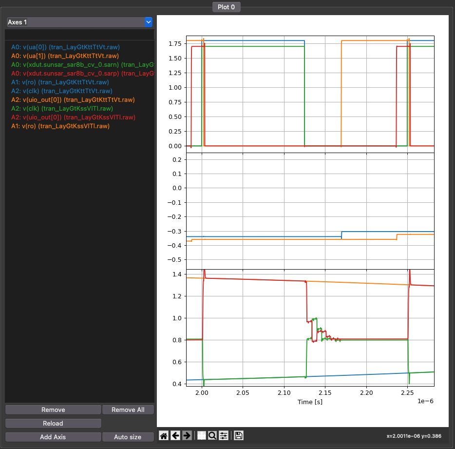

footer: Carsten Wulff 2024
slidenumbers:true
autoscale:true
theme:Plain Jane,1
date: 2024-04-19

<!--pan_skip: -->

# TFE4188 - Lecture 11
# Analog SystemVerilog

<!--pan_title: Lecture 11 - Analog SystemVerilog -->

---

<!--pan_skip: -->

# Goal

Explain why we need **Analog SystemVerilog** models

Introduction to Analog SystemVerilog 

---


<!--pan_skip: -->


#[fit] Why 


---

<!--pan_doc: 

<iframe width="560" height="315" src="https://www.youtube.com/embed/56oK9FAE858" title="YouTube video player" frameborder="0" allow="accelerometer; autoplay; clipboard-write; encrypted-media; gyroscope; picture-in-picture; web-share" allowfullscreen></iframe>


-->


<!--pan_doc:


Design of integrated circuits is split in two, analog design, and digital design. 

Digital design is highly automated. The digital functions are coded in SystemVerilog (yes, I know 
there are others, but don't use those), translated into a gate level netlist, and automatically generated
layout. Not everything is push-button automation, but most is.

Analog design, however, is manual work. We draw schematic, simulation with a mathematical 
model of the real world, draw the analog layout needed for the foundries to make the circuit,
verify that we drew the schematic and layout the same, extract parasitics, simulate again, and in the end
get a GDSII file. 

When we mix analog and digital designs, we have two choices, analog on top, or digital on top. 

In analog on top we take the digital IP, and do the top level layout by hand in analog tools.

In digital on top we include the analog IPs in the SystemVerilog, and allow the digital tools to do the layout. The digital layout is still orchestrated by people. 

Which strategy is chosen depends on the complexity of the integrated circuit. For medium to low level 
of complexity, analog on top is fine. For high complexity ICs, then digital on top is the way to go.

Below is a description of the open source digital-on-top flow. The analog is included into GDSII 
at the OpenRoad stage of the flow. 

The GDSII is not sufficient to integrate the analog IP. The digital needs to know how the analog works, 
what capacitance is on every digital input, the propagation delay for digital input to digital outputs
, the relation between digital outputs and clock inputs, and the possible load on digital outputs.

The details on timing and capacitance is covered in a Liberty file. The behavior, or function 
of the analog circuit must be described in a SystemVerilog file. 

But how do we describe an analog function in SystemVerilog? SystemVerilog is simulated 
in an digital simulator. 


-->

<!--pan_skip: -->


---

# Digital simulation

<!--pan_doc: 

Conceptually, the digital simulator is easy. 

-->

- The order of execution of events at the same time-step do not matter

- The system is causal. Changes in the future do not affect signals in the past or the now


<!--pan_doc:

In a digital simulator there will be an event queue, see below. From start, set the current time step equals 
to the next time step. Check if there are any events scheduled for the time step.
Assume that execution of events will add new time steps. Check if there is another time step, and repeat. 

Since the digital simulator only acts when something is supposed to be done, they are inherently fast, 
and can handle complex systems.

-->


<!--pan_doc:

It's a fun exercise to make a digital simulator. On my Ph.D I wanted to model ADCs, and first
I had a look at SystemC, however, I disliked C++, so I made [SystemDotNet](https://sourceforge.net/projects/systemdotnet/)

In SystemDotNet I implemented the event queue as a hash table, so it ran a bit faster. See below.

-->

---


### Digital Simulators

<!--pan_doc:

There are both commercial an open source tools for digital simulation. If you've never 
used a digital simulator, then I'd recommend you start with iverilog. I've made some examples 
at [dicex](https://github.com/wulffern/dicex/tree/main/project/verilog).

-->

**Commercial**

- [Cadence Excelium](https://www.cadence.com/ko_KR/home/tools/system-design-and-verification/simulation-and-testbench-verification/xcelium-simulator.html)
- [Siemens Questa](https://eda.sw.siemens.com/en-US/ic/questa/simulation/advanced-simulator/)
- [Synopsys VCS](https://www.synopsys.com/verification/simulation/vcs.html)

**Open Source**
- [iverilog/vpp](https://github.com/steveicarus/iverilog)
- [Verilator](https://www.veripool.org/verilator/)
- [SystemDotNet](https://sourceforge.net/projects/systemdotnet/)


---


### Counter

<!--pan_doc:

Below is an example of a counter in  SystemVerilog. The code can be found at [counter_sv](https://github.com/wulffern/dicex/tree/main/sim/verilog/counter_sv).

In the always\_comb section we code what will become the combinatorial logic. 
In the always\_ff section we code what will become our registers. 

-->

[.column]

```verilog
module counter(
               output logic [WIDTH-1:0] out,
               input logic              clk,
               input logic              reset
               );

   parameter WIDTH = 8;

   logic [WIDTH-1:0]                    count;
   always_comb begin
      count = out + 1;
   end

   always_ff @(posedge clk or posedge reset) begin
      if (reset)
        out <= 0;
      else
        out <= count;
   end

endmodule // counter
```

[.column]


<!--pan_doc:

In the context of a digital simulator, we can think through how the event queue will look. 

When the clk or reset changes from zero to 1, then schedule an event where if the reset is 1, then 
out will be zero in the next time step. If reset is 0, then out will be `count` in the next time step. 

In a time-step where `out changes, then schedule an event to set `count` to `out` plus one. As such, each 
positive edge of the clock at least 2 events must be scheduled in the register transfer level (RTL) simulation. 

For example: 
-->

```bash 
Assume `clk, reset, out = 0`

Assume event with `clk = 1`

0: Set `out = count` in next event (1)

1: Set `count = out + 1` using 
   logic (may consume multiple events) 

X: no further events
```
---

<!--pan_doc:

When we synthesis the code below into a [netlist](https://github.com/wulffern/dicex/blob/main/sim/verilog/counter_sv/counter_netlist.v)
it's a bit harder to see how the events will be scheduled, but we can notice that clk and reset
are still inputs, and for example the clock is connected to d-flip-flops. The image below is 
the synthesized netlist

It should feel intuitive that a gate-level netlist will take longer to simulate than an RTL, there
are more events.

-->


---

# Transient analog simulation 


[.column]

<!--pan_doc:

Analog simulation is different. There is no quantized time step. How fast "things" 
happen in the circuit is entirely determined by the time constants, change in voltage, 
and change in current in the system. 

It is possible to have a fixed time-step in analog simulation, for example, we say that nothing
is faster than 1 fs, so we pick that as our time step. If we wanted to simulate 
1 s, however, that's at least 1e15 events, and with 1 event per microsecond on a computer it's still a 
simulation time of 31 years. Not a viable solution for all analog circuits. 

Analog circuits are also non-linear, properties of resistors, capacitors, inductors, diodes may 
depend on the voltage or current across, or in, the device. Solving for all the
non-linear differential equations is tricky.

An analog simulation engine must 
-->
parse spice netlist, and setup partial/ordinary differential equations for node matrix

<!--pan_doc: 

The nodal matrix could look like the matrix below, $i$ are the currents, $v$ the voltages, 
and $G$ the conductances between nodes.

-->

$$
\begin{pmatrix}
G_{11} &G_{12}  &\cdots  &G_{1N} \\ 
G_{21} &G_{22}  &\cdots  &G_{2N} \\ 
\vdots &\vdots  &\ddots  & \vdots\\ 
G_{N1} &G_{N2}  &\cdots  &G_{NN} 
\end{pmatrix}
\begin{pmatrix}
v_1\\ 
v_2\\ 
\vdots\\ 
v_N
\end{pmatrix}=
\begin{pmatrix}
i_1\\ 
i_2\\ 
\vdots\\ 
i_N
\end{pmatrix}
$$


[.column]

<!--pan_doc:

The simulator, and devices 
-->
model the non-linear current/voltage behavior between all nodes

<!--pan_doc:

as such, the $G$'s may be non-linear functions, and include the $v$'s and $i$'s.

Transient analysis use 
-->
numerical methods to compute time evolution 

<!--pan_doc:

The time step is adjusted automatically, often by proprietary algorithms, to trade 
accuracy and simulation speed. 

The numerical methods can be forward/backward Euler, or the others listed below.

-->

- [Euler](https://aquaulb.github.io/book_solving_pde_mooc/solving_pde_mooc/notebooks/02_TimeIntegration/02_01_EulerMethod.html)
- [Runge-Kutta](https://aquaulb.github.io/book_solving_pde_mooc/solving_pde_mooc/notebooks/02_TimeIntegration/02_02_RungeKutta.html)
- [Crank-Nicolson](https://en.wikipedia.org/wiki/Crank%E2%80%93Nicolson_method)
- [Gear](https://ieeexplore.ieee.org/document/1083221)


<!--pan_doc:


If you wish to learn more, I would recommend starting with the original paper on analog transient analysis. 

-->

---

[.column]

[SPICE (Simulation Program with Integrated Circuit Emphasis)](https://www2.eecs.berkeley.edu/Pubs/TechRpts/1973/ERL-m-382.pdf)
published in 1973 by Nagel and Pederson

[.column]

<!--pan_doc:

The original paper has spawned a multitude of commercial, free and open source simulators, some are listed below. 

If you have money, then buy Cadence Spectre. If you have no money, then start with ngspice. 

-->


**Commercial**
- [Cadence Spectre](https://www.cadence.com/ko_KR/home/tools/custom-ic-analog-rf-design/circuit-simulation/spectre-simulation-platform.html)
- [Siemens Eldo](https://eda.sw.siemens.com/en-US/ic/eldo/)
- [Synopsys HSPICE](https://www.synopsys.com/implementation-and-signoff/ams-simulation/primesim-hspice.html)


**Free**
- [Aimspice](http://aimspice.com)
- [Analog Devices LTspice](https://www.analog.com/en/design-center/design-tools-and-calculators/ltspice-simulator.html)
- [xyce](https://xyce.sandia.gov)

**Open Source**
- [ngspice](http://ngspice.sourceforge.net)


---


<!--pan_doc:

# Mixed signal simulation

It is possible to co-simulate both analog and digital functions. An illustration is shown below.

The system will have two simulators, one analog, with transient simulation and differential equation solver,
and a digital, with event queue.

Between the two simulators there would be analog-to-digital, and digital-to-analog converters. 

To orchestrate the time between simulators there must be a global event and time-step control. 
Most often, the digital simulator will end up waiting for the analog simulator.

The challenge with mixed-mode simulation is that if the digital circuit becomes to large,
and the digital simulation must wait for analog solver, then the simulation would take too long. 

Most of the time, it's stupid to try and simulate complex system-on-chip with mixed-signal
, full detail, simulation. 

For IPs, like an ADC, co-simulation works well, and is the best way to verify the digital and analog.

But if we can't run mixed simulation, how do we verify analog with digital?

-->


---


#[fit] Analog SystemVerilog Example

---


## TinyTapeout TT06_SAR

---


---




## SAR operation

<!--pan_doc: 

The key idea is to model the analog behavior to sufficient detail such that we can
verify the digital code. I think it's best to have a look at a concrete example.

-->

- Analog input is sampled when clock goes low (sarp/sarn)
- uio_out[0] goes high when bit-cycling is done
- Digital output (ro) changes when uio_out[0] goes high

---


```verilog
//tt06-sar/src/project.v
module tt_um_TT06_SAR_wulffern (
                                input wire        VGND,
                                input wire        VPWR,
                                input wire [7:0]  ui_in,
                                output wire [7:0] uo_out,
                                input wire [7:0]  uio_in,
                                output wire [7:0] uio_out,
                                output wire [7:0] uio_oe,
`ifdef ANA_TYPE_REAL
                                input real        ua_0,
                                input real        ua_1,
`else
                                inout wire [7:0]  ua, // analog pins
`endif
                                input wire        ena,
                                input wire        clk,
                                input wire        rst_n
                                );

```

---

[.column]

```verilog
//tt06-sar/src/tb_ana.v
`ifdef ANA_TYPE_REAL
   real        ua_0  = 0;
   real        ua_1 = 0;

`else
   tri [7:0]   ua;
   logic       uain = 0;
   assign ua = uain;
`endif

`ifdef ANA_TYPE_REAL
   always #100 begin
      ua_0 = $sin(2*3.14*1/7750*$time);
      ua_1 = -$sin(2*3.14*1/7750*$time);
   end
`endif


```

[.column]

```verilog
//tt06-sar/src/tb_ana.v
   tt_um_TT06_SAR_wulffern dut (
                                .VGND(VGND),
                                .VPWR(VPWR),
                                .ui_in(ui_in),
                                .uo_out(uo_out),
                                .uio_in(uio_in),
                                .uio_out(uio_out),
                                .uio_oe(uio_oe),
`ifdef ANA_TYPE_REAL
                                .ua_0(ua_0),
                                .ua_1(ua_1),
`else
                                .ua(ua),
`endif
                                .ena(ena),
                                .clk(clk),
                                .rst_n(rst_n)
                                );
```

---

```makefile
#tt06-sar/src/Makefile
runa:
	iverilog  -g2012 -o my_design -c tb_ana.fl -DANA_TYPE_REAL
	vvp -n my_design

rund:
	iverilog  -g2012 -o my_design -c tb_ana.fl
	vvp -n my_design
```

---

[.column]

```verilog 
   //tt06-sar/src/project.v
   //Main SAR loop
   always_ff @(posedge clk or negedge clk) begin
      if(~ui_in[0]) begin
         state <= OFF;
         tmp = 0;
         dout = 0;
      end
      else begin
         if(OFF) begin

         end
         else if(clk == 1) begin
            state = SAMPLE;
         end
         else if(clk == 0) begin
            state = CONVERT;
      `ifdef ANA_TYPE_REAL
            smpl = ua_0 - ua_1;
            tmp = smpl;

            for(int i=7;i>=0;i--) begin
               if(tmp >= 0) begin
                  tmp = tmp - lsb*2**(i-1);
                  if(i==7)
                    dout[i] <= 0;
                  else
                    dout[i] <= 1;
               end
```

[.column]

```verilog

               else begin
                  tmp = tmp + lsb*2**(i-1);
                  if(i==7)
                    dout[i] = 1;
                  else
                    dout[i] = 0;
               end
            end
`else
            if(tmp == 0) begin
               dout[7] <= 1;
               tmp <= 1;

            end
            else begin
               dout[7] <= 0;
               tmp  = 0;
            end
`endif

         end
         state = next_state;
      end // else: !if(~ui_in[0])
   end // always_ff @ (posedge clk)
```

---

```verilog
   //tt06-sar/src/project.v
   always @(posedge done) begin
      state = DONE;
      sampled_dout = dout;
   end

   always @(state) begin
      if(state == OFF)
        #2 done = 0;
      else if(state == SAMPLE)
        #1.6 done = 0;
      else if(state == CONVERT)
        #115 done = 1;
   end
```

---


---


<!--pan_doc:


-->


<!--pan_doc:

For more information on real-number modeling I would recommend [The Evolution of Real Number Modeling](https://youtu.be/gNpPslQZT-Y)

<iframe width="560" height="315" src="https://www.youtube.com/embed/gNpPslQZT-Y"
title="YouTube video player" frameborder="0" allow="accelerometer; autoplay;
clipboard-write; encrypted-media; gyroscope; picture-in-picture; web-share"
allowfullscreen></iframe>

-->

---

<!--pan_skip: -->


---

#[fit] Thanks!
