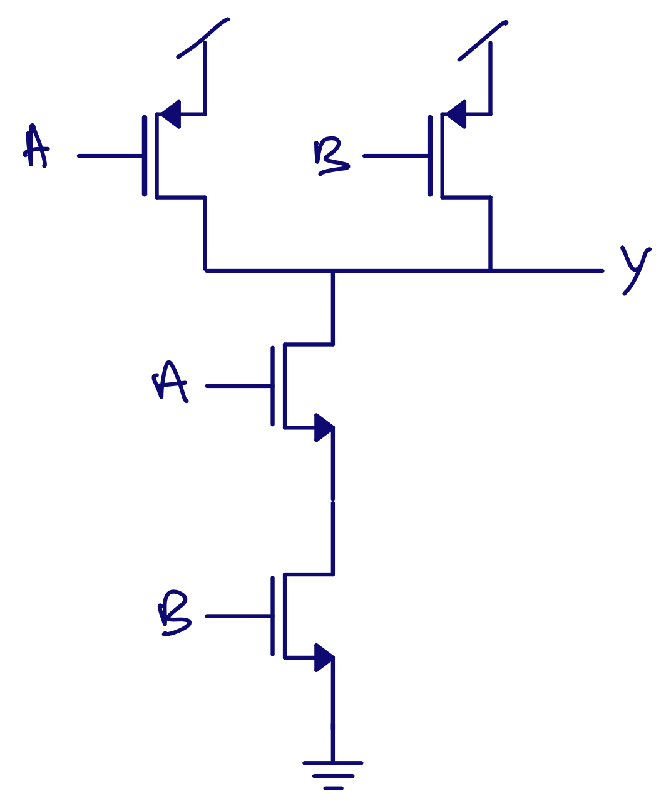

footer: Carsten Wulff 2024
slidenumbers:true
autoscale:true
theme: Plain Jane, 1
text:  Helvetica
header:  Helvetica
date: 2024-04-26

<!--pan_skip: -->

# MOSFETs

<!--pan_title: MOSFETs -->

---

<!--pan_doc: 

I'm stunned if you've never heared the word "transistor". I think most people have heard the word. What I find funny is that almost nobody understand in full detail how transistors work.

Through my 30 year venture into the world of electronics I've met  "analog designers", or people 
that should understand exactly how transistors work. I used to hire analog designers, and I've interviewed hundred plus "analog designers" 
in my 8 years as manager and I've met hundreds of students of analog design. I would go as far as to say none of them know everything
about transistors, including myself.

Most of the people I've met have a good brain, so that is not the reason they don't understand. Transistors are incredibly complicated! 
I say this, because if at some point in this document, **you** don't understand, then don't worry, you are not alone.

In this document I'm focusing on Metal Oxide Semiconductor Field Effect Transistors (MOSFETs), and ignore all other transistors.

-->

---

## Metal Oxide Semiconductor

<!--pan_doc: 

The first part of the MOSFET name illustrates the 3 dimensional composition of the transistor. Take a semiconductor (Silicon), grow 
some oxide (Silicon Oxide, Shim2), and place a metal, or conductive, gate on top of the oxide.
With those three components we can build our transistor. 

Something like the cartoon below, only the Metal (gate) of the MOS name is shown. The oxide and the silicon bulk is not visible, 
but you can imagine them to be underneath the gate, with a thin oxide (a few nano meters thick) 
and the silicon the transparent part of the picture. 

The length (L), and width (W) of the MOS is annotated in blue. 

-->

---

<!--pan_doc:

MOSFETs come in two main types. There is NMOS, and PMOS. The symbols are as shown below. 
The NMOS is NM1 and PMOS is MP1. 

-->

  

<!--pan_doc:

The MOS part of the name can be seen in NM1, where $V_{G}$ is the gate connected to a vertical line (metal), a space (oxide), 
and another vertical line (the silicon substrate). 

On the sides of the gate we have two connections, a drain $V_{D}$ and a source $V_{S}$. 

If we have a sufficient voltage between gate and source $V_{GS}$, then the transistor will conduct from drain to source. 
If the voltage is too low, then there will not be much current. 

The "source" name is because that's where the charge carrier (electrons) come from, they come from the source, and flow towards the drain.
As you may remember, the "current", as we've defined it, flows opposite of the electron current, from drain to source. 

The PMOS works in a similar manner, however, the PMOS is made of a different type of silicon, where the 
dominant charge carrier is holes in the valence band. As a result, the gate-source voltage needs to be negative for the 
PMOS to conduct. 

In a PMOS the holes come from the source, and flow to the drain. Since holes are positive charge carriers, then the current
flows from source to drain.

In most MOSFETs there is no physical difference between source and drain. If you flip
the transistor it would work almost exactly the same. 

-->

## Field Effect 

<!--pan_doc:
Imagine that the bulk (the empty space between the transistor), and the source is connected to 0 V. 
Assume that the gate is 0V. 

In the  source and drain parts of the transistor there is an abundance of electrons that can move around, exactly like in a metal conductor, however, underneath the gate there are almost 
no **free** electrons. 

There are electrons underneath the gate though, trillions upon trillions of electrons, but they are stuck in co-valent bonds
between the Silicon atoms, and around the nucleus of the Silicon atoms. These electrons are what we call bound electrons, they cannot move, or more precisely, they cannot contribute to current (because they do move, all the time). 

Think of the 3d image above. Imagine that your eyes could see the free electrons as a blue fluorescent color. What you would see is a bright blue drain, and bright blue source, but no color underneath the gate.

As you increase the gate voltage, the color underneath the gate would change. First, you would think might be some blue color, but it would be barely noticeable. At a certain voltage, suddenly, there would be a thin blue sheet underneath the gate. You'd have to
zoom in to see it. As you continue to increase the gate voltage the blue color would become a little brighter, but not much.

This thin blue sheet extend from source to drain, and create a conductive channel where the electrons can move from source to drain (or drain to source), exactly like a resistor. The conductance of the sheet is the same as the brightness, higher gate source voltage, more bright blue, higher conductance, less resistance.

Assume you raise the drain voltage. The electrons would move from source to drain proportional to the voltage. 
How many electrons could  move would depend on the gate voltage. 

If the gate voltage was low, then there is low density of electrons, and low current. 

If the gate voltage is high, then the electron density in the sheet is high, and there can be a high current, although, the electrons do 
have a maximum speed, so at some point the current does not change as fast with the gate voltage.

At a certain drain voltage you would see the blue color disappear close to the drain and there would be a gap 
in the sheet. 
That could make you think the current would stop, but it turns out, that the electrons close to drain get swept across 
the gap because the electric field is so high from the edge of the sheet to the drain.

As you continue to increase the drain voltage, the gap increases, but the current does not really increase that much.

And now you may think you understand how the transistor works. By changing the gate voltage, we can change the current from source to drain. We can turn on, and off, currents, creating a 0 and 1 state. 

For example, if I take a PMOS and connect the source to a high voltage, the drain to an output, and an NMOS with the source to ground and the drain to the output, and connect the gates together, I would have the simplest logic gate, an inverter, as shown below. 

If the input $V_{in}$ is a high voltage, then the output $V_{out}$ is a low voltage, because the NMOS is on. If the input $V_{in}$ is a low voltage, then the output $V_{out}$ is a high voltage, because the PMOS is on. 

-->

  

---

<!--pan_doc:

I can now build more complex "logic gates". The one below is a Not-AND gate (NAND). If both inputs (A and B) are high, then the output is low (both NMOS are on). Otherwise, the output is high. 

I find it amazing that all digital computers in existence can be constructed from the NAND gate. In principle, it's the only logic gate you need. If you actually did construct computers from NANDs only, they would be costly, and 
consume lots of power. There are smarter ways to use the transistors. 

-->

  

<!--pan_doc:

You may be too young to have seen the Matrix, but now is the time to decide between the [red pill and the blue pill](https://en.m.wikipedia.org/wiki/Red_pill_and_blue_pill).

The red will start your journey to discover the reality behind the transistor, the blue pill will return you to your normal life, and you can continue to think that you now understand how 
transistors work. 

-->
---

 

<!--pan_doc:

Because, why did the area underneath the gate turn blue?  Why did the blue color change suddenly? And did you realize I never
in this chapter explained how the field effect worked?

-->

---

## It's all quantum 

Someday, I'll write the details. I just need to figure out how I'm going to write it first. 

