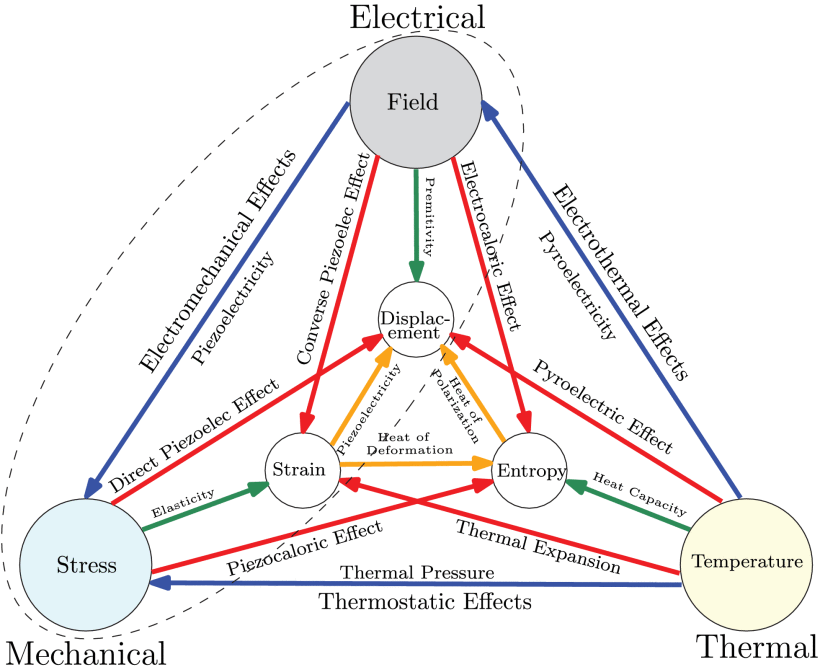
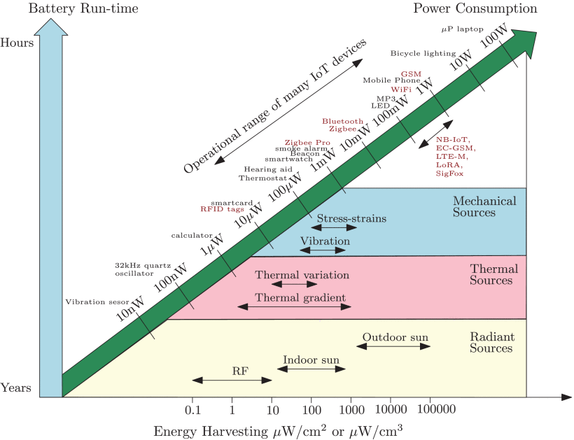
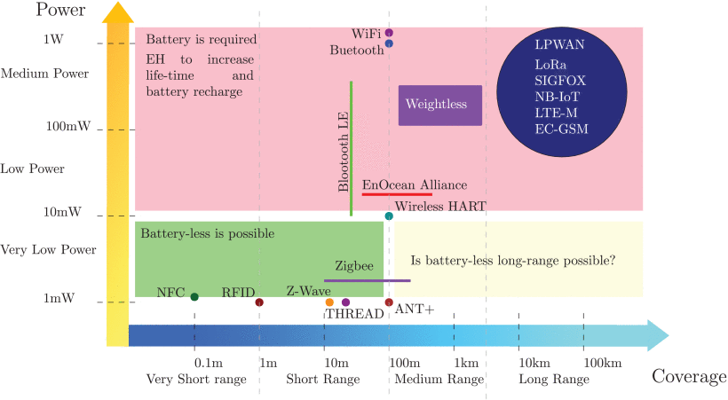
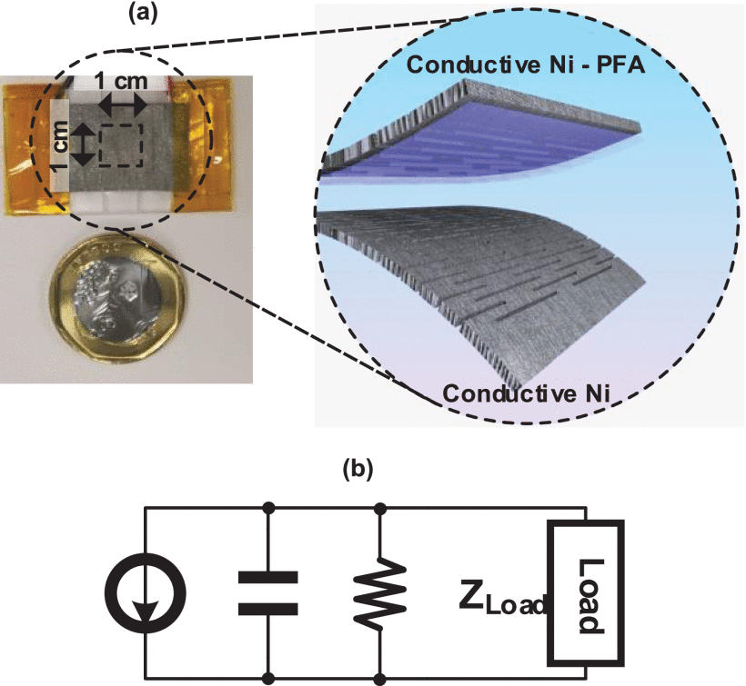
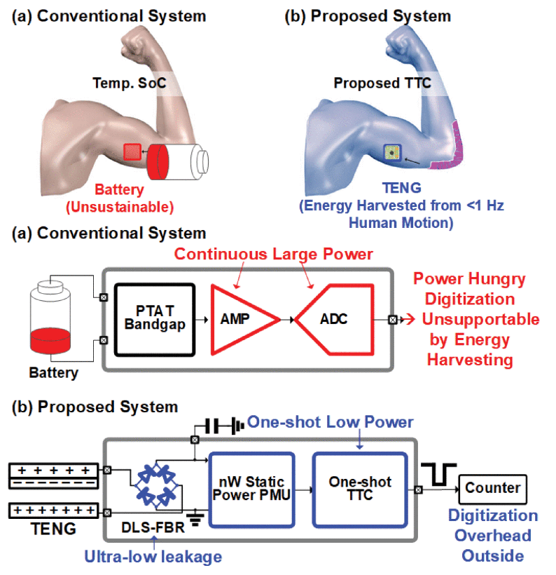
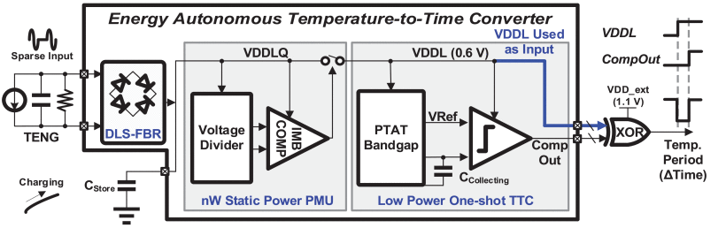
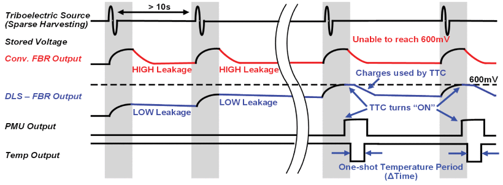
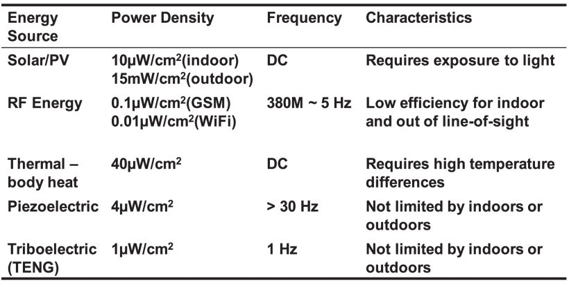

footer: Carsten Wulff 2024
slidenumbers:true
autoscale:true
theme:Plain Jane,1
date: 2024-04-12

<!--pan_skip: -->

# TFE4188 - Lecture X
# Energy Sources

<!--pan_title: Lecture X - Energy Sources -->

---

<!--pan_skip: -->

# Goal

**Why** do we need energy sources? 

Introduction to **Energy Harvesting**

---

<!--pan_skip: -->

#[fit] Why

---

<!--pan_skip: -->

[.column]

--
--
--
--

#[fit] Lithium Battery

[.column]

--
--
--
--

1 year $$ \Rightarrow$$ 45 $$\mu$$W/cm$$^3$$ 

10 year $$ \Rightarrow$$ 3.5 $$\mu$$W/cm$$^3$$ 

---

<!--pan_doc:

<iframe width="560" height="315" src="https://www.youtube.com/embed/Tb2CFHLmkzw?si=4f29EI_Hwj3My9fn" title="YouTube video player" frameborder="0" allow="accelerometer; autoplay; clipboard-write; encrypted-media; gyroscope; picture-in-picture; web-share" referrerpolicy="strict-origin-when-cross-origin" allowfullscreen></iframe>

Integrated circuits are wasteful of energy. Digital circuits charge transistor gates to change states, and when
discharged, the charges are dumped to ground. In analog circuits the transconductance requires a DC current,
a continuous flow of charges from positive supply to ground. 

Integrated circuits are incredibly useful though. Life without would be different. 

A continuous effort from engineers like me have reduced the power consumption of both digital and analog circuits by
order of magnitudes since the invention of the transistor 75 years ago. 

One of the first commercial ADCs, the [DATRAC](https://www.analog.com/media/en/training-seminars/design-handbooks/Data-Conversion-Handbook/Chapter1.pdf) on page 24, was a 11-bit 50 kSps that consumed 500 W. That's Walden figure of merit of 
4 $\mu$J/conv.step. Today's state-of-the-art ADCs in the same sampling range have a Walden figure of merit of [0.6 fJ/conv.step](https://ieeexplore.ieee.org/document/8310273).

4 $\mu$ / 0.6 f = 8.1e9, a difference in power consumption of almost 10 billion times !!!

Improvements to power consumption have become harder and harder, but I believe there is still far to go before we 
cannot reduce power consumption any more. 


[Towards a Green and Self-Powered Internet of Things Using Piezoelectric Energy Harvesting](https://ieeexplore.ieee.org/document/8762143) [1]
has a nice overview of power consumption of technologies, seen in the next figures below.

In the context of energy harvesting, there is energy in electromagnetic fields, temperature, and mechanical stress, and there are ways to translate between them the energy forms.

-->

<!--[fit](https://ieeexplore.ieee.org/mediastore_new/IEEE/content/media/6287639/8600701/8762143/shirv5-2928523-large.gif)-->


---

<!--pan_doc:

Below we can see a figure of the potential energy that can be harvested per volume, and the type power consumption of technologies [1]. 

As devices approach average power consumption of $\mu W$ it becomes possible to harvest the energy from the environment, and do away with the battery.

-->

<!--[fit](https://ieeexplore.ieee.org/mediastore_new/IEEE/content/media/6287639/8600701/8762143/shirv6-2928523-large.gif)-->


---

<!--pan_doc:


For wireless standards, there are some that can be run on energy harvesting. Below is an overview from [1]. Many of us will have a NFC card in our pocket for payment, or entry to buildings. NFC card has a integrated circuit that is powered from the electromagnetic field from the NFC reader. 

Other standards, like Bluetooth, WiFi, LTE are harder to run battery less, because the energy requirement above 1 mW. 

Technologies like Bluetooth LE, however, can approach < 10 $\mu$W for some applications, although the burst power may still be 10 mW to 100 mW. As such, although the average power is low, the energy harvesting cannot support peak loads and a charge storage device is required (battery, super-capacitor, large capacitor).

-->

<!--[inline fit](https://ieeexplore.ieee.org/mediastore_new/IEEE/content/media/6287639/8600701/8762143/shirv11-2928523-large.gif)-->



<!--pan_doc:

I'd like to give you an introduction to the possible ways of harvesting energy. I know of five methods: 
- thermoelectric
- photovoltaic
- piezoelectric
- electromagnetic 
- triboelectric 
-->

---

<!--pan_skip: -->


## Thermoelectric
 
## Photovoltaic

## Piezoelectric

## Electromagnetic 

## Triboelectric 


---

#[fit] [Thermoelectric](https://en.wikipedia.org/wiki/Thermoelectric_effect)


<!--pan_doc:

Apply heat to one end of a metal wire, what happens to the free electrons? As we heat the material we must increase 
the energy of the free electrons at the hot end of the wire. The atoms wiggle more, and when the free electrons scatter off the atomic structure there should be an exchange of energy. Think of the electrons at the hot side as high energy
electrons, while on the cold side there are low energy electrons, I think. 

There will be diffusion current of electrons 
in both directions in the material, however, if the mobility of electrons in the material is dependent on 
the energy, then we would get a difference in current of low energy electrons and high energy electrons. 
A difference in current would lead to a charge difference at the hot end and cold end, 
which would give a difference in voltage.

Take a copper wire, bend it in half, heat the end with the loop, and measure the voltage at the cold end. Would we
measure a voltage difference? 

**NO**, there would not be a voltage difference between the two ends of the wire. The voltage 
on the loop side would be different, but on the cold side, where we have the ends, there would be no voltage difference. 

Gauss law tell us that inside a conductor there cannot be a static field without a current. As such, if there was 
a voltage difference between the cold ends, it would quickly dissipated, and no DC current would flow. 

The voltage difference in the material between the hot and cold end will create currents, but we can't use them if we
only have one type of material. 

Imagine we have Iron and copper wires, as shown below, and we heat one end. In that case, we can draw current between the cold ends. 

-->

---


<!--pan_doc:

The voltage difference at the hot and cold end
is described by the 
-->

---

[Seebeck coefficient](https://en.wikipedia.org/wiki/Seebeck_coefficient)

<!--pan_doc:

Imagine two parallel wires with different Seebeck coefficients, one of copper ($6.5\text{ } \mu V/K$) and one of iron ($19\text{ } \mu/K$).
We connect them at the hot end. The voltage difference between hot and cold would be higher in the iron, than in the copper. 
At the cold end, we would now measure a difference in voltage between the wires! 

In silicon, the Seebeck coefficient can be modified through doping. A model of Seebeck coefficient is shown below. 
The value of the Seebeck coefficient depends on the location of the Fermi level in relation to the Conduction band or the V
valence band. 

-->


---

<!--pan_doc:

In the picture below we have a silicon (the cyan and yellow colors).

Assume we dope with acceptors (yellow, p-type), that shifts the Fermi level closer to the Valence band ($E_V$), and the dominant
current transport will be by holes, maybe we get 1 mV/K from the picture above.

For the material doped with donors (cyan, n-type) the Fermi level is shifted towards the Conduction band ($E_C$), and the dominant 
charge transport is by electrons, maybe we get -1 mV/K from the picture above. 

Assume we have a temperature difference of 50 degrees, then maybe we could get a voltage difference at the cold end of 
100 mV. That's a low voltage, but is possible to use.
--->


<!--pan_doc:

The process can be run in reverse. In the picture below we force a current through the material, 
we heat one end, and cool the other. Maybe you've heard of [Peltier elements](https://en.wikipedia.org/wiki/Thermoelectric_cooling).

-->

---


---

## [Radioisotope Thermoelectric generator](https://en.wikipedia.org/wiki/Radioisotope_thermoelectric_generator)

<!--pan_doc:

Maybe you've heard of a nuclear battery. Sounds fancy, right? Must be complicated, right?

Not really, take some radioactive material, which generates heat, stick a thermoelectric generator to the hot side, 
make sure you can cool the cold side, and we have a nuclear battery.

Nuclear batteries are "simple", and ultra reliable. There's not really a chemical reaction. The nucleus of the 
radioactive material degrades, but not fast. In the thermoelectric generator, there are no moving parts.

In a normal battery there is a chemical reaction that happens when we pull a current. Atoms move around. 
Eventually the chemical battery will change and degrade.

Nuclear batteries were used in Voyager, and they still work to this day. The nuclear battery is the round thing 
underneath Voyager in the picture below. The radioisotopes provide the heat, space provides the cold, and voila, 
[470 W](https://en.wikipedia.org/wiki/Voyager_1) to run the electronics.

-->


---

## [Thermoelectric generators](https://en.wikipedia.org/wiki/Thermoelectric_generator)

<!--pan_doc:

Assume a we wanted to drive a watch from a thermoelectric generator (TEG). 
The skin temperature is maybe 33 degrees Celsius, while the 
ambient temperature is maybe 23 degrees Celsius on average.

From the model of a thermoelectric generator below we'd get a voltage of 10 mV to 500 mV, too low for most integrated circuits.

In order to drive an integrated circuit we'd need to boost the voltage to maybe 1.8 V.

The main challenge with thermoelectric generators is to provide a cold-boot function where the energy harvester starts up at a low voltage. 

In silicon, it is tricky to make anything work below some thermal voltages (kT/q). We at least need about 3 – 4 thermal voltages to make anything function. 

The key enabler for an efficient, low temperature differential, energy harvester is an oscillator that works at low voltage (i.e 75 mV). If we have a clock, then we can boost with capacitors 

-->

In [A 3.5-mV Input Single-Inductor Self-Starting Boost Converter With Loss-Aware MPPT for Efficient Autonomous Body-Heat Energy Harvesting](https://ieeexplore.ieee.org/document/9302641) they use a combination of both switched capacitor and switched inductor boost. 


---

#[fit] [Photovoltaic](https://en.wikipedia.org/wiki/Photovoltaic_effect)

---


<!--pan_doc:

In silicon, photons can knock out electron/hole pairs. If we have a PN junction,
then it’s possible to separate the electron/holes before they recombine as shown in figure below.

An electron/hole pair knocked out in the depletion region (1) will 
separate due to the built-in field. The hole will go to P and the electron to N. 
This increases the voltage VD across the diode. 

A similar effect will occur if the 
electron/hole pair is knocked out in the P region (2). Although the 
P region has an abundance of holes, the electron will not recombine immediately. 
If the  electron diffuses close to the depletion region, then it will be swept across to the N side,
and further increase VD.

On the N-side the same minority carrier effect would further increase the voltage (3).

-->


---

<!--pan_doc:

A circuit model of a Photodiode can be seen in figure below, where it is assumed that a 
single photodiode is used. It is possible to stack photodiodes to get a higher output voltage. 


-->


<!--pan_doc:

As the load current is increased, the voltage VD will drop. As the photo current is increased,
the voltage VD will increase. As such, there is an optimum current load where there is a balance
between the photocurrent, the voltage VD and the load current. 

-->


$$ I_D = I_S\left(e^\frac{V_D}{V_T} - 1\right)$$

$$ I_D = I_{Photo} - I_{Load}$$

$$ V_D = V_T ln{\left(\frac{I_{Photo} - I_{Load}}{I_S} + 1 \right)} $$

$$ P_{Load} = V_D I_{Load}$$


<!--pan_doc:

Below is a model of the power in the load as a function of diode voltage

-->

---

```python
#!/usr/bin/env python3
import numpy as np
import matplotlib.pyplot as plt

m = 1e-3  
i_load = np.linspace(1e-5,1e-3,200)

i_s = 1e-12  # saturation current 
i_ph = 1e-3  # Photocurrent

V_T = 1.38e-23*300/1.6e-19  #Thermal voltage

V_D = V_T*np.log((i_ph - i_load)/(i_s) + 1)

P_load = V_D*i_load

plt.subplot(2,1,1)
plt.plot(i_load/m,V_D)
plt.ylabel("Diode voltage [mA]")
plt.grid()
plt.subplot(2,1,2)
plt.plot(i_load/m,P_load/m)
plt.xlabel("Current load [mA]")
plt.ylabel("Power Load [mW]")
plt.grid()
plt.savefig("pv.pdf")
plt.show()

```

<!--pan_doc:

From the plot below we can see that to optimize the power we could extract from the photovoltaic cell we'd want to have a current 
of 0.9 mA in the model above.

-->


<!--pan_doc:

Most photovoltaic energy harvesting circuits will include a maximum power point tracker 
as the optimum changes with light conditions.

-->

---


<!--pan_skip: -->


[ANYSOLAR](https://www.digikey.no/en/products/detail/anysolar-ltd/KXOB25-03X4F-TB/13999196)


---

In [A Reconfigurable Capacitive Power Converter With Capacitance Redistribution for Indoor Light-Powered Batteryless Internet-of-Things Devices](https://ieeexplore.ieee.org/abstract/document/9423810) they include a maximum power point tracker and a reconfigurable charge pump to optimize efficiency.


---

#[fit] [Piezoelectric](https://en.wikipedia.org/wiki/Piezoelectricity)

<!--pan_doc:

I'm not sure I  understand the piezoelectric effect, but I think it goes something like this.

Consider a crystal made of a combination of elements, for example [Gallium Nitride](http://lampx.tugraz.at/~hadley/ss1/crystalstructure/structures/semiconductors/GaN.html). In GaN it's possible to get a polarization of the unit cell, with a more negative charge on one side, and a positive charge on the other side. The polarization comes from an asymmetry in the electron and nucleus distribution within the material. 

In a polycrystaline substance the polarization domains will usually be random, and no electric field will observable. The polarization domains can be aligned by heating the material and applying a electric field. Now all the small electric fields point in the same direction. 

From Gausses law we know that the electric field through a surface is determined by the volume integral of the charges inside. 

$$ \oint_{\partial \Omega} \mathbf{E} \cdot d\mathbf{S} = \frac{1}{\epsilon_0} \iiint_{V} \rho
\cdot dV$$  

Although there is a net zero charge inside the material, there is an uneven distribution of charges, as such, some of the field lines will cross through the surface. 

Assume we have a polycrystaline GaN material with polarized domains. If we measure the voltage across the material we will read 0 V. Even though the domains are polarized, and we should observe an external electric field, the free charges in the material will redistribute if there is a field inside, such that there is no current flowing, and thus no external field. 

If we apply stress, however, all the domains inside the material will shift. Now the free charges do not exactly cancel the electric field in the material, the free charges are in the wrong place. If we have a material with low conductivity, then it will take time for the free charges to redistribute. As such, for a while, we can measure an voltage across the material.

Assuming the above explanation is true, then there should not be piezoelectric materials with high conductivity, and indeed, most piezoelectric materials have resistance of [$10^{12}$ to $10^{14}$ Ohm](https://www.f3lix-tutorial.com/piezo-materials). 

Vibrations on a piezoelectric material will result in a AC voltage across the surface, which we can harvest. 
-->

---


<!--pan_skip: -->


---

<!--pan_doc:

A model of a piezoelectric transducer can be seen below.

The voltage on the transducer can be on the order of a few volts, 
but the current is usually low (nA – µA). The key challenge is to rectify the AC signal into a DC signal.
It is common to use tricks to reduce the energy waste due to the rectifier.


-->

An example of piezoelectric energy harvester can be found in [A Fully Integrated Split-Electrode SSHC Rectifier for Piezoelectric Energy Harvesting](https://ieeexplore.ieee.org/document/8642406)


---


#[fit] Electromagnetic 

---

## "Near field" harvesting 

Near Field Communication (NFC) operates at close physical distances


Reactive near field or inductive near field

$$ \text{Inductive} < \frac{\lambda}{2 \pi}$$

<!--pan_doc: 

Within the inductive near field the antenna's can "feel" each other. The NFC reader inside the card reader can "feel" the antenna of the NFC tag. When the tag get's
close it will load down the NFC reader by presenting a load impedance. As the circuit inside the tag is powered, it can change the impedance of it's antenna, which is 
sensed by the reader, and thus the reader can get data from the tag. The tag could lock in on the 13.56 MHz frequency and decode both amplitude and phase modulation 
from the reader. 

Since the NFC or Qi system operates at close distances, then the coupling factor between antenna's, or really, inductors, can be decent, and it's 
possible to achieve efficiencies of maybe 70 %.

At Bluetooth frequencies, as can be seen below, it does not really make sense to couple inductors, as they need to be within 2 cm to be in the inductive near field. 
The inductive near field is a significant problem for the coupling between inductors on chip, but I don't think I would use it to transfer power. 

-->

---

|Standard|Frequency [MHz] | Inductive [m]|
|:---|:---:|:---:|
|AirFuel Resonant| 6.78 | 7.03 |
|NFC| 13.56 | 3.52 |
|Qi| 0.205 | 232|
|Bluetooth| 2400 | 0.02|

---

## Ambient RF Harvesting

[.column]

Extremely inefficient idea, but may find special use-cases at short-distance.

<!--pan_doc:

-->


Will get better with beam-forming and directive antennas

<!--pan_doc:

There are companies that think RF harvesting is a good idea. 

-->

[AirFuel RF](https://airfuel.org/airfuel-rf/)


<!--pan_doc:

I think that ambient RF harvesting should tingle your science spidy senses.

Let's consider the power transmitted in wireless standards. Your cellphone may transmit 30 dBm, your WiFi router maybe 20 dBm,
and your Bluetooth LE device 10 dBm. 

In case those numbers don't mean anything to you, below is a conversion to watts.

-->

[.column]

| dBm | W |
| :---: | :---: |
| 30 | 1 |
| 0  | 1 m|
| -30 | 1 u|
| -60 | 1 n |
| -90 | 1 p|

---

<!--pan_doc:

Now ask your self the question "What's the power at a certain distance?". It's easier to flip the question, and 
use Friis to calculate the distance.

-->

Assume $$P_{TX}$$ = 1 W (30 dBm) and $$P_{RX}$$ = 10 uW (-20 dBm)

<!--pan_doc:

then 

-->

$$ D = 10^\frac{P_{TX} - P_{RX} + 20 log_{10}\left(\frac{c}{4 \pi f}\right)}{20} $$

<!--pan_doc:

In the table below we can see the distance is not that far!

-->

| Freq | **$$20 log_{10}\left(c/4 \pi f\right)$$** [dB]| D [m]|
| ----|:----:| ---: |
| 915M | -31.7 | 8.2 | 
| 2.45G | -40.2 | 3.1 |
| 5.80G | -47.7 | 1.3 |


<!--pan_doc:

I believe ambient RF is a stupid idea. 

Assuming an antenna that transmits equally in all direction, then the loss on the first meter is 40 dB at 2.4 GHz.
If I transmitted 1 W, there would only be 100 µW available at 1 meter. 
That’s an efficiency of 0.01 %. 

Just fundamentally stupid. **Stupid, I tell you!!!**

<sub>Stupidity in engineering really annoys me, especially when people don't understand how stupid ideas are.</sub>

-->

---

#[fit] Triboelectric generator

<!--pan_doc: 

Although static electricity is an old phenomenon, 
it is only recently that triboelectric nanogenerators have been used to
harvest energy.

An overview can be seen in [Current progress on power management systems for triboelectric nanogenerators](https://ieeexplore.ieee.org/document/9729411).

A model of a triboelectric generator can be seen in below.
Although the current is  low (nA) the voltage can be high, 
tens to hundreds of volts. 

The key circuit challenge is the rectifier, and the high voltage output of the triboelectric generator. 

-->

---

Take a look in [A Fully Energy-Autonomous Temperature-to-Time Converter Powered by a Triboelectric Energy Harvester for Biomedical Applications](https://ieeexplore.ieee.org/document/9441315)
for more details.


---

<!--pan_doc: 

Below is a custom triboelectric material that converts friction into a sparse electric field. 

-->

<!--[fit](https://ieeexplore.ieee.org/mediastore_new/IEEE/content/media/4/9546917/9441315/yoo6ab-3080383-large.gif)-->


---

<!--pan_doc: 

The key idea of the triboelectric circuit below is to rectify the sparse voltage pulses and store the charge on a capacitor. 
Once the voltage is high enough, then a temperature sensor is started. 

-->

<!--[fit](https://ieeexplore.ieee.org/mediastore_new/IEEE/content/media/4/9546917/9441315/yoo1ab-3080383-large.gif)-->



---

<!--pan_doc:

Below is some more details on the operation of the harvesting circuit, and the temperature sensor. Notice how the temperature sensor part of the circuit (PTAT bandgap, capacitor and comparator)
produce a pulse width modulated signal that depends on temperature. 

Also notice the "VDD_ext" in the figure. That means the system is not fully harvested. The paper is a prime example on how we in academia can ignore key portions of 
a system. They've focused on the harvesting part, and making the temperature dependent pulse width modulated signal. Maybe they've completely ignored how the data
is transmitted from the system to where it would be used, and that's OK. 

It's academia's job to prove that something could be possible. It's industry's job to make some that could be possible actually work.

-->

<!--
[inline fit](https://ieeexplore.ieee.org/mediastore_new/IEEE/content/media/4/9546917/9441315/yoo2-3080383-large.gif)

[inline fit](https://ieeexplore.ieee.org/mediastore_new/IEEE/content/media/4/9546917/9441315/yoo3-3080383-large.gif)
-->






---

#[fit] Comparison

---

<!--pan_doc:

Imagine you're a engineer in a company that makes integrated circuits. Your CEO comes to you and says
"You need to make a power management IC that harvest energy and works with everything".

Hopefully, your response would now be "That's a stupid idea, any energy harvester circuit must be made specifically 
for the energy source".

Thermoelectric and photovoltaic provide low DC voltage. Piezoelectric and Triboelectric provide an AC voltage. 
Ambient RF is stupid. 

For a "energy harvesting circuit" you must also know the application (wrist watch, or wall switch) to know
what energy source is available.

Below is a table that show's a comparison in the power that can be extracted. 

The power levels below
are too low for the peak power consumption of integrated circuits, so most applications must include 
a charge storage device, either a battery, or a capacitor.

-->

<!--[fit](https://ieeexplore.ieee.org/mediastore_new/IEEE/content/media/4/9546917/9441315/yoo4-3080383-large.gif)-->



---

# Want to learn more?

[1] [Towards a Green and Self-Powered Internet of Things Using Piezoelectric Energy Harvesting](https://ieeexplore.ieee.org/document/8762143)

[A 3.5-mV Input Single-Inductor Self-Starting Boost Converter With Loss-Aware MPPT for Efficient Autonomous Body-Heat Energy Harvesting](https://ieeexplore.ieee.org/document/9302641)

[A Reconfigurable Capacitive Power Converter With Capacitance Redistribution for Indoor Light-Powered Batteryless Internet- of-Things Devices](https://ieeexplore.ieee.org/abstract/document/9423810)

[A Fully Integrated Split-Electrode SSHC Rectifier for Piezoelectric Energy Harvesting](https://ieeexplore.ieee.org/document/8642406)

[Current progress on power management systems for triboelectric nanogenerators](https://ieeexplore.ieee.org/document/9729411)

[A Fully Energy-Autonomous Temperature-to-Time Converter Powered by a Triboelectric Energy Harvester for Biomedical Applications](https://ieeexplore.ieee.org/document/9441315)


---


#[fit] Thanks!


